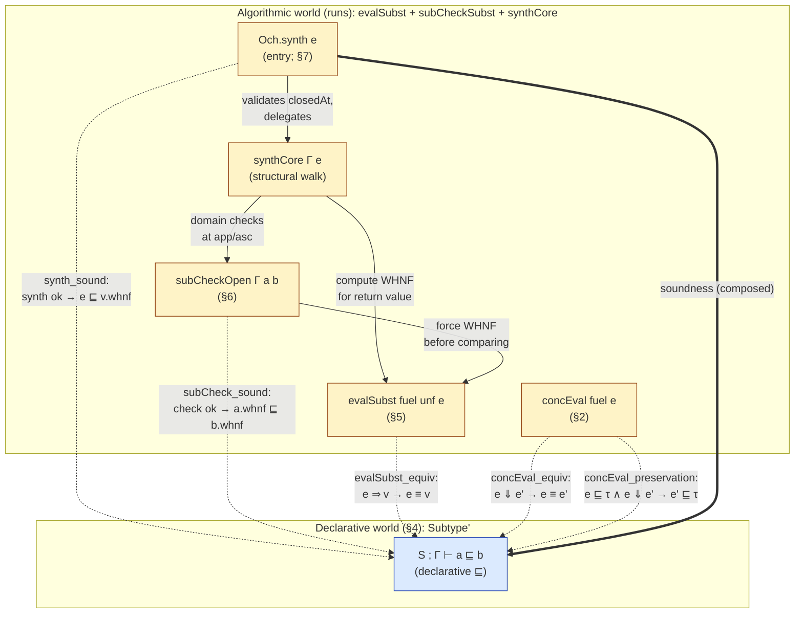

# Och: A Core Calculus with Iota/Fix and Equirecursive Subtyping

Och is the core calculus on which the Ochre language's metatheory is developed.
It is a dependently-typed λ-calculus with two recursive-binder forms —
**ι** (Cedille-style self-types) and **fix** (general recursion at the type
and term level) — and a single syntactic category in which terms and types
coincide. The checker is a structural type-synthesis walk (`synthCore`)
layered on a substitution-based WHNF evaluator (`evalSubst`), and the
subtyping relation is equirecursive with Brandt–Henglein coinductive
hypotheses.

This document specifies Och as a type system: the term syntax, the concrete
operational semantics, the declarative subtyping relation, and the
algorithmic typing/subtyping judgments. Inference rules follow the indented
convention described in [docs/notation.md](../../docs/notation.md) —
conclusion first, premises indented beneath — rather than the horizontal-bar
format.

### Naming convention: named binders, not de Bruijn

Throughout this document, binders and variables are written with ordinary
names (`x`, `y`, `self`, `A`, `B`, `f`, `a`, …) and substitution is written
`body[x ↦ v]`. Binders are annotated with their bound name: `λ(x : A). e`,
`ι(self : A). B`, `fix(self : A). b`, `let x = v in body`. Context lookup
is `Γ(x)`; context extension is `Γ, x : A`.

This is a presentational choice for readability, not a formalism choice.
**The Lean formalisation uses de Bruijn indices throughout** —
[`Expr.bvar`](Syntax.lean#L38), [`Expr.shift`](Syntax.lean#L112),
`body.subst 0 v`, `Γ : List Expr` indexed by position — and that is what
the `Soundness/` and `Subtyping.lean` statements actually prove. When
porting a rule from this document to the codebase: a named variable `x`
bound at the innermost binder becomes `bvar 0`, a variable bound `k`
binders out becomes `bvar k`, substitution `body[x ↦ v]` becomes
`body.subst 0 v` at the binding site (with `Expr.shift` composed in if
`v` lives at a different depth), and the de Bruijn shift `τ.shift(k+1)`
in the formalisation's `[S-Var]` disappears from the named form because
named variables don't need re-indexing.

**Future work on Och/Ochre should uphold this convention** in all
externally-facing documentation, papers, and specifications — even
though the formalisation remains in de Bruijn form. Readers should never
need to understand index arithmetic to follow the type system. The de
Bruijn details are an implementation concern confined to the Lean
sources.

### Cross-references to the formalisation and decision history

Every judgment, rule, and theorem in this document is backed by a
definition or proof in the Lean codebase, and many rules reflect
specific design decisions made at specific points in the project's
history. References take two forms:

- **Code links.** Lines like
  [`Subtype'`](Subtyping.lean#L77) or
  [`concEval_equiv`](Soundness/ConcEvalPreservation.lean#L48) point at the exact
  declaration in the Lean sources. These anchor the English
  description to the machine-checked statement. Keep them current as
  files move; a stale link is worse than no link because it silently
  claims correspondence that no longer holds.
- **Commit hashes.** Lines like
  [`fb53b4c`](https://github.com/charlielidbury/ochre/commit/fb53b4c)
  cite the commit where a design decision was made. The commit message
  is the canonical record of *why* the decision was made — often at
  more depth than fits in this document — and `claude-ask <agent-id>
  "…"` can interrogate the authoring agent for further context
  (see [`CLAUDE.md`](../../CLAUDE.md)). Include the date in prose when
  citing.

**Future work on Och/Ochre should add such references whenever a
non-obvious design choice is documented here.** If a rule has a
surprising premise, a subtle variance, an explicit-constructor
formulation where admissibility would have been natural, or any other
decision that a reader might question — cite the commit that made the
call. The commit message, not this document, is where the full
rationale lives; this document's job is to point there. Conversely, if
a rule is stated here without a backing code link, that is a signal
that either the formalisation doesn't yet match or the link was lost
during an edit; in both cases it should be added.

## 1. Syntax

The term language (source: [lean/Och/Syntax.lean](Syntax.lean#L38)) is

```
e, τ ::= x                   // variable
       | Type                // universe / top
       | Bot                 // primitive bottom (universal lower bound)
       | λ(x : τ). e         // lambda
       | e₁ e₂               // application
       | ι(self : τ). e      // self-type binder
       | fix(self : τ). e    // recursive binder
       | (e : τ)             // ascription (erased at runtime)
       | let x = e₁ in e₂    // let-binding
```

There is no separate type category: every τ above is itself a term. In the
formalisation, binders use de Bruijn indices
([`Expr.bvar`](Syntax.lean#L38)), so α-equivalent terms are syntactically
identical and capture-avoiding substitution reduces to index arithmetic
(`shift`/`subst`, [lean/Och/Syntax.lean](Syntax.lean#L112)); this document
writes bound names only.

**Iota vs fix.** Both bind a self-reference (written `self` by convention)
in their body, and both have an annotation `τ` recording the
non-self-referential type. They differ in how they unfold. A value
`v : ι(self : A). B` inhabits `B[self ↦ v]` — the body's self-reference
points at the inhabitant itself, giving dependent elimination. A value
`v : fix(self : A). B` equi-recursively equals its unfolding `B[self ↦ v]`.
Historically these were a single `μ` constructor; the split
([docs/research/iota-fix-split.md](../../docs/research/iota-fix-split.md))
gives each a narrower congruence and unfolding rule.

Throughout the paper `Γ` denotes a typing context (a finite map from
variable names to their declared types, innermost-first in the
formalisation: [lean/Och/Subtyping.lean](Subtyping.lean#L27)).

## 2. Concrete semantics — the evaluation judgment

The concrete evaluator `concEval` ([lean/Och/Eval.lean](Eval.lean#L62)) is a
substitution-based call-by-value big-step interpreter on closed terms.
Lambdas, ι, and fix are values; applications in function position unroll the
recursive binder by substituting its self-reference, then re-apply.

Write the judgment `e ⇓ v` for "closed term `e` concretely evaluates to value
`v`." Values `v ::= λ(x:τ).e | ι(self:τ).e | fix(self:τ).e | Type | x e⃗`
(neutral application spine with a stuck variable head).

```
[E-Val]                       // e ∈ {Type, λ.., ι.., fix..}
e ⇓ e

[E-Asc]
(e : τ) ⇓ v
  e ⇓ v

[E-Let]
(let x = e₁ in e₂) ⇓ v
  e₁ ⇓ v₁
  e₂[x ↦ v₁] ⇓ v

[E-App-β]
f a ⇓ v
  f ⇓ λ(x:τ). b
  a ⇓ vₐ
  b[x ↦ vₐ] ⇓ v

[E-App-ι]
f a ⇓ v
  f ⇓ ι(self:τ). b
  a ⇓ vₐ
  (b[self ↦ ι(self:τ).b]) vₐ ⇓ v

[E-App-fix]
f a ⇓ v
  f ⇓ fix(self:τ). b
  a ⇓ vₐ
  (b[self ↦ fix(self:τ).b]) vₐ ⇓ v

[E-App-Neutral]               // head is stuck
f a ⇓ f' vₐ
  f ⇓ f'
  a ⇓ vₐ
```

Free variables are not values; `concEval` returns `none` on them. Ascription
is erased at evaluation ([E-Asc]); the declarative `[S-Asc-L]` rule (§4.4)
provides the corresponding transparency for `concEval_equiv`. The dispatch
on ι/fix heads is realised in [Eval.lean](Eval.lean#L82).

**Bot is a self-evaluating value.** Like `Type`, `Bot` evaluates to
itself via `[E-Val]` and has no application dispatch arm — the
`.lam`/`.iota`/`.fix` head-match in `concEval`'s `.app` case doesn't
cover `.bot`, so applying an argument to Bot is *stuck* (parallel to
`Type`-application). This is intentional: Bot is a type, not a
callable. The typing discipline must ensure well-typed programs never
reach `Bot a` at runtime; under `synthCore`'s structural walk (§7)
this should not arise in practice. `synth_progress` (§8) proves that
synth-accepted closed terms never produce `.error` from `concEval`.

This is the **operational specification** of the language. The algorithmic
type-checker is connected to it via
[`concEval_equiv`](Soundness/ConcEvalPreservation.lean) and
[`concEval_preservation`](Soundness.lean#L129). Both are **sorry-free**
— `concEval_equiv` is a bidirectional equivalence proved by induction on
fuel and case analysis on `e`; `concEval_preservation` derives from it
via `Subtype'.trans`. See §8 for the full proof architecture.

## 3. Overview of the algorithmic relations

Three judgments make up the algorithmic side of Och. This section
introduces each one's semantic role and explains how they compose;
the full rules appear in §§5–7.

### `S ; Γ ⊢ a ⊑ₑ b` — structural subtype check (§6)

Decides whether well-typed WHNF term `a` is a subtype of well-typed
WHNF term `b` under context `Γ`, given coinductive hypotheses `S`.
Both inputs must already be well-typed and in WHNF — the caller
(`~>`) is responsible for ensuring this.

The check is purely structural: it pattern-matches on the head
constructors of `a` and `b` and recurses. Under binders it opens
both sides with a fresh level-variable and extends `Γ` with
the narrower of the two domains (always the RHS, since the
contravariance check `domB ⊑ domA` has already passed). The
seen-set `S` provides coinductive closure for equirecursive types
(§4.3 of the declarative subtyping). Internally, `⊑ₑ` normalises
intermediate terms (e.g. after substituting into an unfolded body)
via a WHNF evaluator (`evalSubst`, §5) — this is safe because
substituting a well-typed term into a well-typed body preserves
well-typedness.

The key property: `⊑ₑ` is **monotone in `Γ`** — narrowing any
context entry preserves the judgment. If `S ; Γ ⊢ a ⊑ₑ b` holds
and we replace `Γ(k)` with any narrower (more specific) term
`C ⊑ Γ(k)`, the check still succeeds. Conceptually, each context
entry describes a set of possible values; replacing it with a
subset can only make more subtype relationships provable, never
fewer. The check only inspects `Γ` entries via neutral ascent
(§6.3), which widens a neutral to its declared type — a narrower
declared type is still at least as wide as the neutral itself, so
every ascent that succeeded under the wider context also succeeds
under the narrower one.

### `Γ ⊢ e ~> v` — type synthesis (§7)

Validates that `e` is well-typed under context `Γ` and returns its
WHNF `v` as a type-witness (since in Och a value *is* its own
most-precise type, by `[S-Refl]`). This is where type checking
happens: at every application `f a`, the walk synthesises both
sides, exposes a Π from the function, and asks `⊑ₑ` whether the
argument inhabits the domain. Binder annotations must subtype
`Type`.

The semantic guarantee of `~>` is that the term it accepts will
remain well-typed under any narrowing of the context — that is,
when abstract variables are replaced by narrower (more specific)
values. This is the bridge between static checking and runtime
execution: when we check a function body `b` under `(Γ, x : A)`
with `x` abstract, the synthesis walk asks `⊑ₑ` questions like
"does this expression inhabit the domain `A`?" Later, when
`concEval` runs `b[x ↦ v]` with a concrete `v` that is narrower
than `A`, every subtype question the walk asked is at least as
easy — a narrower context can only make more things provable,
never fewer. So the abstract check is a sound over-approximation
of every possible concrete execution.

### `e ⇓ v` — concrete evaluation (§2)

The reference big-step interpreter on closed terms (no
level-variables, no open context). This is what actually runs
programs. It is defined independently of the type-checker and has
no access to a context or type information — it is a pure
untyped evaluator.

The connection to the type-checker is through two soundness
theorems: **preservation** (`e ⊑ τ` and `e ⇓ v` imply `v ⊑ τ`)
and **progress** (`~>` accepted `e` implies `⇓` never gets stuck).
Together these say: if you type-check first, the evaluator either
produces a well-typed value or runs out of fuel — it never reaches
a stuck state.

### How they compose

```
                    ┌─────────────────────────────────┐
 source term  ──►  │  Γ ⊢ e ~> v   (§7)               │
                    │    │                             │
                    │    │ domain checks at app/asc    │
                    │    ▼                             │
                    │  S ; Γ ⊢ a ⊑ₑ b  (§6)           │
                    └─────────────────────────────────┘
                                  │
                          accept / reject
                                  │
                    ┌─────────────▼───────────────────┐
  (if accepted)     │  e ⇓ v   (§2)                    │
                    │  runtime, closed terms only      │
                    └─────────────────────────────────┘
```

The top box is the static phase: `~>` walks the term, calling `⊑ₑ`
for each typing obligation. If the walk accepts, the term enters the
runtime phase: `⇓` evaluates it without any type information.
Soundness (§8) connects the two phases — the static acceptance
guarantees that the runtime evaluation is well-behaved.

## 4. Declarative subtyping

Subtyping in Och means set inclusion: `A ⊑ B` iff every value of `A` is also
a value of `B`. The relation is
[`Subtype' : Seen → Ctx → Expr → Expr → Prop`](Subtyping.lean#L77), written

```
S ; Γ ⊢ a ⊑ b
```

### Context `Γ`

`Γ` is the typing context — a finite ordered list of `(variable, type)`
pairs, with the most recent binder at the front. Lookup is `Γ(x)` for
the declared type of `x`; extension is `Γ, x : A`. The context carries no
well-formedness side conditions in `Subtype'` itself — those are
enforced by the type-checker's structural walk (`synthCore` in
[`API.lean`](API.lean)).

In the formalisation, `Γ : List Expr` is indexed by de Bruijn position
with the innermost binder at index 0; a use-site must shift the declared
type by the number of intervening binders (see the named form of
`[S-Var]` below, and contrast with the formalisation's
`τ.shift(k+1)`).

### Seen set `S`

`S` is a set of pairs `(a, b)` — ancestor subtyping goals introduced by
productive unfolding rules (ι-introduction and the four `unfold_*`
rules, §4.3). The invariant: only those five rules extend `S`; every
other rule propagates it unchanged. This is the Brandt–Henglein device
for equirecursive subtyping — coinductive assumptions are only legal
after at least one productive step, so reflexivity of a non-productive
goal cannot be closed by a hypothesis.

`S` was introduced in
[`85b066e`](https://github.com/charlielidbury/ochre/commit/85b066e)
(2026-04-17) to fix SoundnessAudit A4: `dtrue ⊑ dBool` loops through a
contravariant domain that needs the same goal again; the algorithm
already closed this coinductively via its seen-set, and the declarative
relation now does too.

The "real" subtyping judgment is `∅ ; Γ ⊢ a ⊑ b` (empty hypothesis set);
non-empty `S` arises only inside a derivation.

### Rule taxonomy

The rules fall into four categories. Each serves a distinct purpose;
knowing which category a rule belongs to predicts its shape.

| Category                     | Purpose                                                                    | Rules                                                                              | Extends `S`? |
| ---------------------------- | -------------------------------------------------------------------------- | ---------------------------------------------------------------------------------- | :----------: |
| Structural (§4.1)            | Plumbing: compose, lookup, without inspecting constructors on either side  | `S-Refl`, `S-Top`, `S-BotL`, `S-Trans`, `S-Hyp`, `S-Var`                           | no           |
| Congruence (§4.2)            | Match constructor on both sides; reduce to sub-obligations with variance   | `S-Lam`, `S-App-Cong`, `S-Iota-Cong`, `S-Fix-Cong`, `S-LetE-Cong`                  | no           |
| Productive unfolding (§4.3)  | Unfold a recursive binder (ι/fix); extend `S`; enable coinductive closure  | `S-Iota-Intro`, `S-Unfold-Iota-L`, `S-Unfold-Iota-R`, `S-Unfold-Fix-L`, `S-Unfold-Fix-R` | **yes**  |
| Conversion (§4.4)            | Close under head reduction so the algorithmic evaluator is sound           | `S-Beta-L/R`, `S-Let-L/R`, `S-Asc-L`, `S-Asc-L-Ann`, `S-Asc-R`                     | no           |

The `S`-extension column matters: `S-Hyp` can only fire against
entries that some ancestor productive rule installed, so any path to
`S-Hyp` must cross an unfold — the productivity requirement made
mechanical.

> **Formalisation aside.** In the Lean sources, `S` is
> `List (Nat × Expr × Expr)` — each entry is depth-tagged with the
> `|Γ|` at which it was recorded, and `.hyp` shifts the entry's free
> variables to the current depth on use
> (`a.shift(|Γ|-d)`, `b.shift(|Γ|-d)`). The depth-tag was added in
> [`8d86c69`](https://github.com/charlielidbury/ochre/commit/8d86c69)
> (2026-04-19) so `ctx_extend_at`'s binder cases close with IH and goal
> seen-sets coinciding on the nose. Named-form presentation avoids all
> of this: free variables carry their own names, so no shift is ever
> required at lookup time.

### 4.1 Structural rules

"Structural" rules talk about `⊑` as a relation on terms without inspecting
either side's head constructor: reflexivity, transitivity, the top element,
hypothesis lookup, and variable lookup. These are the plumbing that lets
derivations compose; they produce no new sub-obligations about constructor
shapes.

```
[S-Refl]
S ; Γ ⊢ e ⊑ e

[S-Top]
S ; Γ ⊢ e ⊑ Type

[S-BotL]                      // Bot is the universal lower bound
S ; Γ ⊢ Bot ⊑ e

[S-Trans]                     // explicit constructor — see note below
S ; Γ ⊢ a ⊑ c
  S ; Γ ⊢ a ⊑ b
  S ; Γ ⊢ b ⊑ c

[S-Hyp]                       // (a, b) recorded under an ancestor
S ; Γ ⊢ a ⊑ b                //    productive rule
  (a, b) ∈ S

[S-Var]                       // variable's declared type
S ; Γ ⊢ x ⊑ Γ(x)
```

**Ex falso via subsumption.** There is no dedicated "absurd" eliminator
(no Coq-style `False.elim`). If `a ⊑ Bot` is derivable, then `a ⊑ e` for
every `e` via `[S-Trans]` on `[S-BotL]`. The "contradiction" discharge is
subsumption alone. This matches the DOT tradition: Bot inhabits every
type trivially in subtyping, so any term whose type is already `Bot`
flows into any expected type without further ceremony. See
[`docs/ideas/bottom.md`](../../docs/ideas/bottom.md) for design rationale.

**Why `[S-Trans]` is a constructor, not a derived theorem.** In a normal
simply-typed subtyping relation, transitivity is admissible: a standard
induction on the shape of the two derivations composes them. That argument
requires a decreasing syntactic measure — typically, both derivations get
strictly smaller in each case of the composition. Och's four `unfold_*`
rules and `iota_intro` break this: unfolding `fix(self : A). body`
replaces it with `body[self ↦ fix(self : A). body]`, which is *larger*
than the original.
There's no obvious structural measure on derivations that decreases
through an unfold, so transitivity is not derivable by induction on
derivations. The seen-set discipline of §4.3 is the coinductive
counterpart that keeps the relation consistent, but it doesn't by itself
give admissibility of `trans`.

This was the motivation for making `trans` an explicit constructor in
[`fb53b4c`](https://github.com/charlielidbury/ochre/commit/fb53b4c)
(2026-04-17, "Subtype': sync with the algorithm"). A prior
commit [`bd52114`](https://github.com/charlielidbury/ochre/commit/bd52114)
had *removed* `trans` while proving a pre-seen-set version of
monotonicity, and [`b78f29f`](https://github.com/charlielidbury/ochre/commit/b78f29f)
had briefly *proven* a `Subtype'.trans` theorem in the old setting — but
both predate the ι/fix split and the equirecursive unfolds, and neither
survived the move to the current formulation.

### 4.2 Congruence rules

Congruence rules are the opposite of structural: they *do* inspect the
head constructor on both sides, require it to match, and reduce the goal
to sub-obligations on the immediate sub-terms with appropriate variance.
They're how the relation lifts from leaves to compound terms. Each
constructor of `Expr` with a subterm (λ, ι, fix, app, let) gets one rule.
Ascriptions (`:`) are handled by the conversion rules of §4.4 rather than
a congruence — they peel asymmetrically (LHS → annotation, RHS → inner
value) rather than requiring both sides to be ascriptions with matching
sub-terms. See §4.4 for the mixed-transparency design and its
motivation.

```
[S-Lam]                       // contravariant dom, covariant body
S ; Γ ⊢ (λ(x : A₁). b₁) ⊑ (λ(x : A₂). b₂)
  S ; Γ ⊢ A₂ ⊑ A₁
  S ; (Γ, x : A₂) ⊢ b₁ ⊑ b₂

[S-App-Cong]                  // args must be *equivalent* (SoundnessAudit A1)
S ; Γ ⊢ (f₂ a₂) ⊑ (f₁ a₁)
  S ; Γ ⊢ f₂ ⊑ f₁
  S ; Γ ⊢ a₂ ⊑ a₁
  S ; Γ ⊢ a₁ ⊑ a₂

[S-Iota-Cong]
S ; Γ ⊢ (ι(self : A₁). B₁) ⊑ (ι(self : A₂). B₂)
  S ; Γ ⊢ A₁ ⊑ A₂
  S ; (Γ, self : A₂) ⊢ B₁ ⊑ B₂

[S-Fix-Cong]
S ; Γ ⊢ (fix(self : A₁). b₁) ⊑ (fix(self : A₂). b₂)
  S ; Γ ⊢ A₁ ⊑ A₂
  S ; (Γ, self : A₂) ⊢ b₁ ⊑ b₂

[S-LetE-Cong]
S ; Γ ⊢ (let x = v₁ in b₁) ⊑ (let x = v₂ in b₂)
  S ; Γ ⊢ v₁ ⊑ v₂
  S ; (Γ, x : v₂) ⊢ b₁ ⊑ b₂
```

The equivalence premise on `[S-App-Cong]` (both directions on the
argument) was introduced in
[`047e59f`](https://github.com/charlielidbury/ochre/commit/047e59f)
(2026-04-17, SoundnessAudit A1). The old unidirectional rule accepted
`Pair zero unit ⊑ Pair Nat Unit` under a Church-encoded `Pair`, but that
pair could be eliminated with a projection that β-reduced the goal to
`zero → Unit ⊑ Nat → Unit`, which fails on the domain. A neutral head
can use its argument at any variance, so equivalence is the only sound
congruence. The `iota`, `fix`, and `letE` congruences were added later
alongside `Equiv.subst_resp` in
[`5169447`](https://github.com/charlielidbury/ochre/commit/5169447).

### 4.3 Productive unfolding (extend `S`)

A rule is *productive* when it replaces a goal whose head is a recursive
binder (ι or fix) with a goal where that binder has been unfolded once —
substituting the binder for its own bound variable in the body. Unfolding
makes the term *larger* in syntactic size, so no structural induction can
traverse an arbitrary chain of unfolds. Productivity instead provides a
*coinductive* handle: once at least one unfold has fired, the original
goal is guaranteed to eventually re-appear as an ancestor, at which point
`[S-Hyp]` can close the derivation. This is what makes equirecursive
subtyping consistent — any infinite derivation must pass through a
productive step infinitely often, so every goal either terminates or is
eventually discharged by a hypothesis.

The rules below are the only ones that extend `S`. All other rules
propagate `S` unchanged, which means `[S-Hyp]` is only available on paths
that have crossed at least one unfold — exactly the productivity
requirement.

```
[S-Iota-Intro]                // Cedille value-sub; checks both ann and body
S ; Γ ⊢ a ⊑ ι(self : A). B
  S' ; Γ ⊢ a ⊑ A              // S' = S ∪ { (a, ι(self:A).B) }
  S' ; Γ ⊢ a ⊑ B[self ↦ a]

[S-Unfold-Iota-L]
S ; Γ ⊢ (ι(self : A). B) ⊑ c
  S' ; Γ ⊢ B[self ↦ ι(self:A).B] ⊑ c

[S-Unfold-Iota-R]             // weaker than iota-intro; no ann premise
S ; Γ ⊢ a ⊑ ι(self : A). B
  S' ; Γ ⊢ a ⊑ B[self ↦ ι(self:A).B]

[S-Unfold-Fix-L]
S ; Γ ⊢ (fix(self : A). b) ⊑ c
  S' ; Γ ⊢ b[self ↦ fix(self:A).b] ⊑ c

[S-Unfold-Fix-R]
S ; Γ ⊢ a ⊑ fix(self : A). b
  S' ; Γ ⊢ a ⊑ b[self ↦ fix(self:A).b]
```

The `unfold_iota_R` rule was added in
[`d19f092`](https://github.com/charlielidbury/ochre/commit/d19f092) as
the weaker sibling of `iota_intro` (same conclusion, no annotation
premise) required to close `Equiv.iota_unfold` and therefore
`concEval_equiv`'s `.app`-with-`.iota`-head case.

**Worked example: `dtrue ⊑ dBool`.** With

```
dtrue := ι(self : Type).      λ(P : self → Type). λ(t : P self). λ(f : Type). t
dBool := fix(B : Type). ι(self : B). λ(P : B    → Type). λ(t : P dtrue). λ(f : P dfalse). P self
```

the subtyping check `∅ ; Γ ⊢ dtrue ⊑ dBool` loops through a
contravariant domain: `dBool`'s motive parameter is `P : dBool → Type`,
while `dtrue`'s is `P : self → Type` where `self` is the inhabitant —
ultimately `dtrue`. So the `[S-Lam]` contravariant premise for the
`P` binder demands `dBool ⊑ dtrue`… which needs the original
relationship back. Without the seen set this loops forever; with it,
the productive unfold at the top installs `(dtrue, dBool)` into `S`,
and the loop closes via `[S-Hyp]`:

Read top-down (conclusion first, premises indented beneath — the
same convention as every rule in this document). Rule annotations
are in comments; `S₁ = {(dtrue, dBool)}`.

```
∅ ; Γ ⊢ dtrue ⊑ dBool                              // root goal
  // [S-Unfold-Fix-R]  — records (dtrue, dBool) in S. Let S₁ = that.
  S₁ ; Γ ⊢ dtrue ⊑ ι(self : dBool). λ(P : dBool → Type).
                                    λ(t : P dtrue).
                                    λ(f : P dfalse).
                                    P self
    // [S-Iota-Intro]  — annotation and body premises both inherit S₁.
    //
    // Annotation premise:
    S₁ ; Γ ⊢ dtrue ⊑ dBool                         // the root goal reappears!
      // [S-Hyp]  (dtrue, dBool) ∈ S₁  ✓ closes
    //
    // Body premise (sketch, after [self ↦ dtrue] substitution):
    S₁ ; Γ ⊢ dtrue ⊑ λ(P : dBool → Type).
                     λ(t : P dtrue).
                     λ(f : P dfalse).
                     P dtrue
      // Further structural reduction via [S-Lam] etc.
      // Any path that re-encounters dtrue ⊑ dBool — e.g. the
      // contravariant P-domain premise (dBool → Type) ⊑ (dtrue → Type)
      // — closes via [S-Hyp] the same way.
```

Both branches of `[S-Iota-Intro]` find the root goal waiting in `S₁`
and close via `[S-Hyp]`. This is the Brandt–Henglein discipline in
action: recursion in the subtyping judgment is legal *only across a
productive unfold*, so non-productive loops (e.g. reflexivity-by-loop)
cannot sneak through.

### 4.4 Conversion

The algorithm normalises before comparing, so the declarative relation must
be closed under head reduction. These rules provide that closure.

```
[S-Beta-L]
S ; Γ ⊢ (λ(x : A). body) arg ⊑ b
  S ; Γ ⊢ body[x ↦ arg] ⊑ b

[S-Beta-R]
S ; Γ ⊢ a ⊑ (λ(x : A). body) arg
  S ; Γ ⊢ a ⊑ body[x ↦ arg]

[S-Let-L]
S ; Γ ⊢ (let x = val in body) ⊑ b
  S ; Γ ⊢ body[x ↦ val] ⊑ b

[S-Let-R]
S ; Γ ⊢ a ⊑ (let x = val in body)
  S ; Γ ⊢ a ⊑ body[x ↦ val]

[S-Asc-L]                        // transparent: sees inner value
S ; Γ ⊢ (e : τ) ⊑ b
  S ; Γ ⊢ e ⊑ b

[S-Asc-L-Ann]                    // narrowing: sees annotation
S ; Γ ⊢ (e : τ) ⊑ b
  S ; Γ ⊢ τ ⊑ b

[S-Asc-R]                        // sees inner value
S ; Γ ⊢ a ⊑ (e : τ)
  S ; Γ ⊢ a ⊑ e
```

**Ascription rules: mixed transparency.** Ascription has three rules,
not two. On the **RHS**, `[S-Asc-R]` sees through to the inner value
`e` — the ascription doesn't widen the set of values it contains. On
the **LHS**, both rules coexist: `[S-Asc-L]` (transparent, sees `e`)
is needed by `concEval_equiv` because the runtime erases ascriptions,
while `[S-Asc-L-Ann]` (narrowing, sees `τ`) is what the algorithmic
checker uses — it peels an LHS ascription to the annotation, so the
caller sees `τ`, not the precise inner value.

Given `A ⊑ B ⊑ C`, the mixed rules give the expected behavior:

| Goal | Rule | Reduces to | Holds? |
|---|---|---|---|
| `(A : B) ⊑ C` | `Asc-L-Ann` | `B ⊑ C` | yes |
| `A ⊑ (B : C)` | `Asc-R` | `A ⊑ B` | yes |
| `B ⊑ (A : C)` | `Asc-R` | `B ⊑ A` | **no** |
| `(A : C) ⊑ B` | `Asc-L-Ann` | `C ⊑ B` | **no** |

The transparent `[S-Asc-L]` also closes cases 1 and 4 via the inner
value (`A ⊑ C` and `A ⊑ B` respectively), but the algorithmic checker
only uses `[S-Asc-L-Ann]`. The declarative relation admits both paths;
the algorithm is an under-approximation, which is sound.

## 5. Substitution-based evaluation

`evalSubst` ([lean/Och/EvalSubst.lean](EvalSubst.lean#L468)) is a
substitution-based WHNF evaluator. It replaces the env-based NbE
pipeline (`eval`/`vapp`/`quote` over a `Val`/`Closure` domain) that
was retired in the engine-collapse refactor (2026-04-27,
[`86aa82a`](https://github.com/charlielidbury/ochre/commit/86aa82a)).
Input and output are both `Expr` — there is no separate `Val` type,
no closures, no environments, and no quoting step.

### 5.1 Design

The key simplification: because `Expr` serves as both AST and value,
β-reduction is literal syntactic substitution — `body[x ↦ arg]` via
`substL`. Lambdas, ι-binders, and fix-binders are already in WHNF and
evaluate to themselves. Applications reduce by substituting the
evaluated argument into the function's body. The evaluator is a single
non-mutual function (contrast NbE's three-way `eval`/`vapp`/`quote`
mutual block).

Two fuel parameters bound the computation:

- **`fuel`**: overall step budget. Every recursive call decrements it.
- **`unf`**: unfold budget for ι/fix heads in application position.
  Decremented on each self-referential unfold; when exhausted, the
  application is left as a stuck neutral `(f a)`. Prevents divergence
  on non-terminating self-application chains.

The lex ordering `(fuel, unf)` gives a structurally decreasing
termination measure, so `evalSubst` is non-partial in Lean — equation
lemmas auto-generate.

### 5.2 Level-variables for open terms

The subtype checker (§6) needs to compare terms under binders — e.g.
to check `λ(x:A).b₁ ⊑ λ(x:A).b₂`, it opens both bodies with a
fresh variable and recurses. Rather than introduce a separate `Val`
domain with neutral placeholders, the engine encodes free variables
as **level-variables**: `bvar` indices in a reserved high range
(`levelOffset = 100_000_000`). A level-variable `bvar(levelOffset + k)`
represents the free variable introduced at de Bruijn *level* `k`
(counted from the context root, not the innermost binder). Level-vars
are stable under further binder-openings — opening a new binder
introduces `bvar(levelOffset + k+1)` without shifting existing
level-vars.

This encoding lets the entire algorithmic pipeline — evaluation,
subtype checking, type synthesis — operate on a single `Expr` type
with no `Val`/`Neutral`/`Closure` machinery.

> **Formalisation aside.** `isLevelIdx k` tests whether an index is
> in the level-var range. `openFresh body depth` substitutes
> `bvar(levelOffset + depth)` for `bvar 0` in `body`.
> `substL`/`shiftL` are the level-aware counterparts of
> `Expr.subst`/`Expr.shift` that leave level-vars untouched.

### 5.3 Evaluation rules

Write the judgment `e ⇒ v` for "`evalSubst` reduces `e` to WHNF `v`."

```
[ES-Type]
Type ⇒ Type

[ES-Bot]
Bot ⇒ Bot

[ES-Lam]                      // already in WHNF
(λ(x : A). b) ⇒ (λ(x : A). b)

[ES-Iota]                     // already in WHNF
(ι(self : A). b) ⇒ (ι(self : A). b)

[ES-Fix]                      // already in WHNF
(fix(self : A). b) ⇒ (fix(self : A). b)

[ES-LevelVar]                 // free level-var is neutral
x ⇒ x                         // x = bvar(levelOffset + k)

[ES-Asc]                      // ascription preserved (WHNF form)
(e : τ) ⇒ (e' : τ')
  e ⇒ e'
  τ ⇒ τ'

[ES-Let]                      // β for let
(let x = val in body) ⇒ v
  val ⇒ v₁
  body[x ↦ v₁] ⇒ v

[ES-App-β]                    // λ-application
f a ⇒ v
  f ⇒ λ(x : A). body
  a ⇒ vₐ
  body[x ↦ vₐ] ⇒ v

[ES-App-ι-Unfold]             // ι unfold (¬neutral(a) ∧ unf > 0)
f a ⇒ v
  f ⇒ ι(self : A). body
  a ⇒ vₐ          where ¬neutral(vₐ) ∧ unf > 0
  (body[self ↦ f]) vₐ ⇒ v              // recurse with unf-1

[ES-App-ι-Stuck]              // ι stuck (neutral(a) ∨ unf = 0)
f a ⇒ f' vₐ
  f ⇒ f'          where f' = ι(..)
  a ⇒ vₐ          where neutral(vₐ) ∨ unf = 0

[ES-App-fix-Unfold]           // fix unfold (symmetric to ι)
f a ⇒ v
  f ⇒ fix(self : A). body
  a ⇒ vₐ          where ¬neutral(vₐ) ∧ unf > 0
  (body[self ↦ f]) vₐ ⇒ v              // recurse with unf-1

[ES-App-fix-Stuck]            // fix stuck
f a ⇒ f' vₐ
  f ⇒ f'          where f' = fix(..)
  a ⇒ vₐ          where neutral(vₐ) ∨ unf = 0

[ES-App-Asc]                  // strip ascription in function position
f a ⇒ v
  f ⇒ (inner : τ)
  (inner a) ⇒ v

[ES-App-Neutral]              // head is stuck
f a ⇒ f' vₐ
  f ⇒ f'          where neutral(f') ∨ f' ∈ {Type, Bot}
  a ⇒ vₐ
```

### 5.4 Historical note: NbE and why it was retired

Och originally used an env-based NbE pipeline with three mutually
recursive operations (`eval : Expr → Val`, `vapp : Val → Val → Val`,
`quote : Val → Expr`) over a separate `Val`/`Closure`/`Env` domain.
The NbE evaluator was introduced in
[`4488378`](https://github.com/charlielidbury/ochre/commit/4488378)
(2026-04-16). NbE's sharing advantage (closures avoid copying
substituends) was empirically irrelevant on Och's workload — the
substitution-based evaluator was ~280× faster on heavy cases like
`three_ ⊑ Nat_` (see
[`docs/ideas/eval-subst-vs-env-benchmark.md`](../../docs/ideas/eval-subst-vs-env-benchmark.md)).
The NbE machinery (`NbE.lean`, `SubCheckVal.lean`, `TypedNbE.lean`,
`MemoRefs.lean`) was deleted in the engine-collapse refactor
(commits [`fcc2891`](https://github.com/charlielidbury/ochre/commit/fcc2891)
through [`9d4cfac`](https://github.com/charlielidbury/ochre/commit/9d4cfac),
2026-04-27).

The substitution-based design also simplifies the soundness proof:
input and output share the same type (`Expr`), so there is no
quote-totality obligation (the old NbE proof needed to show that
every intermediate `Val` could be quoted back to an `Expr`, which
hit a fundamental impossibility for non-total λ-calculus — see
[`docs/ideas/quote-witness-feasibility.md`](../../docs/ideas/quote-witness-feasibility.md)).

## 6. Algorithmic subtyping on expressions

[`subCheckSubst`](EvalSubst.lean#L573) is the algorithmic realisation of
§4. It operates directly on `Expr`s in WHNF (not on a separate `Val`
type). The subtype checker and `evalSubst` live in the same file as a
mutual block with a lex `(fuel, phase)` termination measure — the
checker calls `evalSubst` to force WHNF before comparing, and calls
itself recursively under binders.

Write the judgment `S ; Γ ⊢ a ⊑ₑ b` for the algorithmic check, where
`a, b : Expr` are in WHNF, `S` is a list of `(Expr × Expr)` pairs
(the seen-set), and `Γ` is a `TyCtx` (array mapping level indices to
their declared types).

### 6.1 Top-level dispatch (`subCheckSubst`)

Before case-splitting on shapes, `subCheckSubst` forces both sides to
WHNF via `evalSubst`, then **peels ascriptions asymmetrically**:

- LHS `.asc _ τ` → replace with `τ` (annotation; narrowing)
- RHS `.asc e _` → replace with `e` (inner value; content)

After peeling, three fast paths fire in order:

1. **Syntactic equality** (`a'' == b''`): immediate accept.
2. **Seen-set hit** (`(a'', b'') ∈ S`): coinductive accept.
3. **Top** (`b'' == Type`): immediate accept.

If none fires, it delegates to `subCheckSubstMatch` for the per-shape
case analysis.

### 6.2 Per-shape rules (`subCheckSubstMatch`)

```
[AS-BotL]                     // Bot ⊑ anything
S ; Γ ⊢ Bot ⊑ₑ b

[AS-Lam]                      // contravariant dom, covariant body
S ; Γ ⊢ (λ(x : A₁). b₁) ⊑ₑ (λ(x : A₂). b₂)
  S ; Γ ⊢ A₂ ⊑ₑ A₁
  S ; (Γ, x : A₂) ⊢ b₁[x↦fresh] ⊑ₑ b₂[x↦fresh]

[AS-Iota-Iota]                // structural attempt, then iotaIntro fallback
S ; Γ ⊢ (ι(self : A₁). B₁) ⊑ₑ (ι(self : A₂). B₂)
  try:
    S ; Γ ⊢ A₁ ⊑ₑ A₂
    S ; (Γ, self : A₂) ⊢ B₁[self↦fresh] ⊑ₑ B₂[self↦fresh]
  fallback (iotaIntro):
    S' ; Γ ⊢ a ⊑ₑ A₂                        // S' = (a,b) :: S
    S' ; Γ ⊢ a ⊑ₑ B₂[self ↦ a]

[AS-Fix-Fix]                  // structural attempt, then unfold-R fallback
S ; Γ ⊢ (fix(self : A₁). b₁) ⊑ₑ (fix(self : A₂). b₂)
  try:
    S ; Γ ⊢ A₁ ⊑ₑ A₂
    S ; (Γ, self : A₂) ⊢ b₁[self↦fresh] ⊑ₑ b₂[self↦fresh]
  fallback (unfold-R):
    S' ; Γ ⊢ a ⊑ₑ b₂[self ↦ b]              // S' = (a,b) :: S

[AS-Iota-Intro]               // _ ⊑ ι: Cedille-style introduction
S ; Γ ⊢ a ⊑ₑ (ι(self : A). B)
  S' ; Γ ⊢ a ⊑ₑ A                            // S' = (a, ι(self:A).B) :: S
  S' ; Γ ⊢ a ⊑ₑ B[self ↦ a]

[AS-Unfold-Fix-R]             // _ ⊑ fix: unfold RHS
S ; Γ ⊢ a ⊑ₑ (fix(self : A). b)
  S' ; Γ ⊢ a ⊑ₑ b[self ↦ fix(self:A).b]     // S' = (a, fix..) :: S

[AS-Unfold-Fix-L]             // fix ⊑ _: unfold LHS
S ; Γ ⊢ (fix(self : A). b) ⊑ₑ c
  S' ; Γ ⊢ b[self ↦ fix(self:A).b] ⊑ₑ c     // S' = (fix.., c) :: S

[AS-Unfold-Iota-L]            // ι ⊑ _: unfold LHS
S ; Γ ⊢ (ι(self : A). B) ⊑ₑ c
  S' ; Γ ⊢ B[self ↦ ι(self:A).B] ⊑ₑ c       // S' = (ι.., c) :: S
```

### 6.3 Neutral handling

When both sides are neutral (level-var-headed spines), the checker
tries **spine comparison** ([`subCheckSpine`](EvalSubst.lean#L722)):
heads must be the same level-var; arguments must be pairwise
*equivalent* (checked in both directions, matching `[S-App-Cong]`).

If spine comparison fails, or if only the LHS is neutral, the checker
falls back to **neutral ascent** ([`neutralAscent`](EvalSubst.lean#L742)):
it synthesises the LHS neutral's type by walking its spine through
`Γ` ([`synthNeutralType`](EvalSubst.lean#L760)), then recurses with
the synthesised type on the LHS. This corresponds to `[S-Var]` in the
declarative relation — a neutral ascends to its declared type.

```
[AS-Spine]                    // both neutrals, spine match
S ; Γ ⊢ (x e₁ … eₙ) ⊑ₑ (x e₁' … eₙ')
  x = x                                       // same head level-var
  S ; Γ ⊢ eᵢ ⊑ₑ eᵢ'     for each i           // forward
  S ; Γ ⊢ eᵢ' ⊑ₑ eᵢ     for each i           // backward (equivalence)

[AS-Ascent]                   // LHS neutral, ascend to declared type
S ; Γ ⊢ n ⊑ₑ b
  synthNeutralType(Γ, n) = some τ
  S ; Γ ⊢ τ ⊑ₑ b
```

### 6.4 Π-exposure helper

[`whnfPi`](EvalSubst.lean#L911) unfolds a fix/ι wrapper in a type
until a `.lam` (Π) head is exposed. For fix, the self-reference is
the fix itself (μ-unfold); for ι, the self-reference is the
*inhabitant* whose type is being computed — `n : ι(self : A). B`
means `n : B[self ↦ n]`. Returns `none` on `.bot` (Bot is not a Π
head). Used by `synthCore`'s app arm (§7) and by
`synthNeutralType`'s spine walk.

### 6.5 Public API wrappers

- [`subCheck`](EvalSubst.lean#L802): closed-term check. Forces WHNF
  on both sides, delegates to `subCheckSubst` with empty `Γ` and
  empty seen-set.
- [`subCheckOpen`](EvalSubst.lean#L865): open-term check under a
  non-empty `Γ`.
- [`neutralType`](EvalSubst.lean#L887): public mirror of
  `synthNeutralType`, used by `synthCore`'s app arm.

## 7. Algorithmic typing (`synthCore`)

[`synthCore`](API.lean#L150) is the top-level type-synthesis walk.
It replaces the bidirectional `tyInfer`/`tyCheck` pair from the
NbE-era architecture. Where the old bidirectional checker dispatched
between synthesis and checking modes and delegated type comparison to
`subCheckVal` on `Val`s, `synthCore` is a single structural walk over
`Expr` that delegates all typing questions to the complete structural
engine `subCheckOpen` (§6).

### 7.1 Design

`synthCore Γ e` walks `e` recursively, returning its WHNF — which,
by Och's Refl-typing convention (`a ⊑ a`), doubles as the
most-precise type. At every node that introduces a typing obligation
(applications, ascriptions), it calls `subCheckOpen` to verify the
obligation. The walk is *not* bidirectional: there is no separate
checking mode. The `Γ` argument is a `TyEnv` (array of `Expr`)
mapping level indices to the WHNF types of free variables introduced
by binder-opening.

The public entry point [`Och.synth`](API.lean#L308) validates
`e.closedAt 0` at entry and wraps the result in an opaque
[`WTValue`](API.lean#L99) (whose `mk` constructor is `private`, so
the only way to obtain one is through `synth`).

### 7.2 Synthesis rules

```
[I-Type]                                         // API.lean
Γ ⊢ Type ~> Type

[I-Bot]
Γ ⊢ Bot ~> Bot

[I-Var]                                          // Refl-typing convention
Γ ⊢ x ~> x                                       // x = levelVar(k), k < |Γ|

[I-Lam]
Γ ⊢ (λ(x : A). b) ~> whnf(λ(x : A). b)
  Γ ⊢ A ⊑ₑ Type                               // domain is a type
  domV ← whnf(A)
  (Γ, x : domV) ⊢ b[x↦fresh] ~> _bodyTy       // validate body

[I-Iota]                                         // symmetric to I-Lam
Γ ⊢ (ι(self : A). b) ~> whnf(ι(self : A). b)
  Γ ⊢ A ⊑ₑ Type
  annV ← whnf(A)
  (Γ, self : annV) ⊢ b[self↦fresh] ~> _bodyTy

[I-Fix]                                          // symmetric to I-Lam
Γ ⊢ (fix(self : A). b) ~> whnf(fix(self : A). b)
  Γ ⊢ A ⊑ₑ Type
  annV ← whnf(A)
  (Γ, self : annV) ⊢ b[self↦fresh] ~> _bodyTy

[I-Asc]
Γ ⊢ (e : τ) ~> whnf(e : τ)                       // ascription is a WHNF form
  Γ ⊢ τ ⊑ₑ Type                               // annotation is a type
  τV ← whnf(τ)
  Γ ⊢ e ~> v                                    // synthesise inner
  Γ ⊢ v ⊑ₑ τV                                  // inner ⊑ annotation

[I-Let]
Γ ⊢ (let x = val in body) ~> whnf(let x = val in body)
  Γ ⊢ val ~> valV
  (Γ, x : valV) ⊢ body[x↦fresh] ~> _bodyTy

[I-App]
Γ ⊢ f a ~> whnf(piExpr aV)
  Γ ⊢ f ~> vF                                   // synthesise function
  Γ ⊢ a ~> vA                                   // synthesise argument
  aV ← whnf(a)
  fV ← whnf(f)
  piExpr ← exposePi(fV, vF)                     // expose Π from value or
                  or exposePi(fV, neutralType(Γ, fV))  // from ascended type
  match piExpr with (λ(x : dom). body) →
    Γ ⊢ vA ⊑ₑ dom                               // THE domain check
      or Γ ⊢ neutralType(Γ, aV) ⊑ₑ dom          // fallback: ascend arg
      or Γ ⊢ aV ⊑ₑ dom                          // fallback: raw value
    return whnf(piExpr aV)
```

**Refl-typing convention.** Canonical forms (lam, iota, fix)
synthesise themselves: `synthCore` returns `whnf(e)` for these nodes.
Since `a ⊑ a` holds declaratively by `[S-Refl]`, the synthesised
WHNF is trivially a valid type-witness.

**Why not bidirectional.** The previous `tyInfer`/`tyCheck`
architecture was algorithmically incomplete on Och programs: the
bidirectional walk stalled on the A6-family of well-formed programs
(`succ_`, `one_`, `mkVec`, `appendVec`, etc.) because the mode
dispatch couldn't propagate enough type information through
elimination forms. The pragmatic fallback — accept `tyInfer`'s
`.error` and fall through to `evalSubst` — silently accepted
ill-typed terms like `appendVec_wrong`. `synthCore` bypasses the
mode dispatch entirely and asks the *complete* structural engine
(`subCheckOpen`) to decide each domain check directly. See
[`API.lean`](API.lean) lines 64–78 for the full rationale.

**Bot in `synthCore`.** `Bot` synthesises itself via `[I-Bot]`.
`whnfPi fuel inhab .bot = none` — Bot is not a Π head, so applying
an argument to Bot-typed function fails at the `exposePi` step in
`[I-App]`. See [`docs/ideas/bottom.md`](../../docs/ideas/bottom.md)
for the full design.

### 7.3 Abstract interpretation of bodies

When `synthCore` enters a binder (lam, iota, fix, let), it opens the
body by substituting a fresh level-variable for `bvar 0` and
extends `Γ` with the annotation's WHNF. The level-variable is
**neutral** with respect to `evalSubst` — it evaluates to itself,
blocks β-reduction, and propagates through application spines as a
stuck head. This is the substitution-based analogue of NbE's "open
closure with fresh free variable": the level-var acts as a symbolic
"any value of this type," and the structural subtype checker can
compare bodies containing level-vars by spine-walking and ascending
through `Γ`.

## 8. Metatheory

Soundness theorems ([lean/Och/Soundness.lean](Soundness.lean)) link
the concrete semantics (§2), the declarative subtyping (§4), and the
algorithmic checker (§§5–7).



Reading guide:

- **Algorithmic world (yellow)**: what actually runs. `Och.synth` is
  the user-facing entry; it delegates to `synthCore` (the structural
  walk), which calls `subCheckOpen` for each typing obligation and
  `evalSubst` to compute WHNFs. `concEval` is the separate big-step
  reference evaluator for closed terms (§2).
- **Declarative world (blue)**: the formal semantics. `Subtype'` is
  the derivation relation (§4).
- **Dashed arrows** between the two worlds are *soundness theorems*:
  each says "algorithm says OK ⟹ declarative derivation exists."
- **The heavy arrow `soundness (composed)`** is the user-level
  composition: "if `synth e` accepted AND `subCheck a b` accepted
  AND `concEval e` produced some `e'`, then `e' ⊑ b.whnf`
  declaratively."

### 8.0 Proof architecture

The soundness proof is split across several files in
[`Soundness/`](Soundness/):

| File | Theorem | Status |
|---|---|---|
| [`ConcEvalPreservation.lean`](Soundness/ConcEvalPreservation.lean) | `concEval_equiv`, `concEval_preservation_aux` | **sorry-free** |
| [`SynthProgress.lean`](Soundness/SynthProgress.lean) | `concEval_no_error` | **sorry-free** |
| [`EvalSubstEquiv.lean`](Soundness/EvalSubstEquiv.lean) | `evalSubst_equiv`, `evalSubst_preservation_aux` | 3 sorries (`WALL_substL_depth` + bridge walls) |
| [`EvalSubstLemmas.lean`](Soundness/EvalSubstLemmas.lean) | `evalSubst_fuel_mono`, `evalSubst_closedAtLvl`, `substL_eq_subst` helpers | **sorry-free** |
| [`SubtypeSteps.lean`](Soundness/SubtypeSteps.lean) | one-step `Subtype'` lemmas (β, unfold, asc) | **sorry-free** |
| [`CloseAll.lean`](Soundness/CloseAll.lean) | `closeAll` translation lemmas | 5 sorries |
| [`SubCheckSubstStructural.lean`](Soundness/SubCheckSubstStructural.lean) | lam-lam, iota-iota, fix-fix arm packages | 2 sorries |
| [`SubCheckSubstFallback.lean`](Soundness/SubCheckSubstFallback.lean) | iotaIntro, unfold-fix-R/L, unfold-iota-L arm packages | 3 sorries |
| [`SubCheckSubstNeutral.lean`](Soundness/SubCheckSubstNeutral.lean) | spine, ascent arm packages | 2 sorries |
| [`SubCheckSubstSoundness.lean`](Soundness/SubCheckSubstSoundness.lean) | `subCheckSubst_sound`, `Och_subCheck_sound` (composition) | 33 sorries |
| [`SynthSound.lean`](Soundness/SynthSound.lean) | `Och_synth_sound` | 5 sorries |

The key structural difference from the old NbE-era proof: there is no
`Val`-level intermediate relation (`SubV`, `R`). The proofs connect
the algorithmic `subCheckSubst` directly to `Subtype'` via per-arm
lemma packages, each of which constructs a `Subtype'` derivation from
the algorithmic accept. The `closeAll` function translates between
level-var-encoded open terms and de Bruijn terms in `Subtype'`'s
context.

**Subtyping soundness.**
[`subCheck_sound`](Soundness.lean#L111) — if the algorithm accepts two
validated values, they are declaratively subtypes.

```
Och.subCheck a b fuel = .ok true
 ⟹  ∅ ; ∅ ⊢ a.whnf ⊑ b.whnf
```

The proof routes through `subCheckSubst_sound` (induction on fuel,
dispatching to per-arm packages) and `closeAll` (translating
level-vars to de Bruijn context entries).

**Synthesis soundness.**
[`synth_sound`](Soundness.lean#L92) — if `synth` accepts `e`, then
`e` declaratively subtypes its synthesised WHNF.

```
Och.synth e fuel = .ok v
 ⟹  ∅ ; ∅ ⊢ e ⊑ v.whnf
```

Structural induction on `e`. All arms closed except `.app`, which
is the remaining wall (`synthCore_app_WALL`).

**Evaluation equivalence.**
[`concEval_equiv`](Soundness/ConcEvalPreservation.lean) — if `e`
evaluates to `e'`, both directions of subtyping hold. **Sorry-free.**

```
e.closedAt 0 = true
  ∧ concEval fuel e = .ok e'
 ⟹  ∅ ; ∅ ⊢ e' ⊑ e  ∧  ∅ ; ∅ ⊢ e ⊑ e'
```

**Preservation.**
[`concEval_preservation`](Soundness.lean#L129) — standard type
preservation. **Sorry-free** (derives from `concEval_equiv` via
`Subtype'.trans`).

**Progress.**
[`synth_progress`](Soundness.lean#L153) — a synth-accepted term
doesn't get stuck during evaluation. `concEval` may return
`.ok value` or `.outOfFuel` but never `.error`. **Sorry-free.**

```
Och.synth e fuel = .ok v
 ⟹  ∀ f msg, concEval f e ≠ .error msg
```

**End-to-end.**
[`soundness`](Soundness.lean#L174) composes the above: if `synth e`
and `synth τ` both succeed, `subCheck` accepts, and `concEval e`
produces `e'`, then `e' ⊑ τ.whnf` declaratively.

```
soundness :
  Och.synth e fuel = .ok a
  ∧ Och.subCheck a b fuel = .ok true
  ∧ concEval fuel e = .ok e'
 ⟹  ∅ ; ∅ ⊢ e' ⊑ b.whnf
```

The composition itself is **sorry-free** — it chains `synth_sound`,
`subCheck_sound`, and `concEval_preservation`.

### 8.1 What soundness promises to the programmer

Two separable runtime properties a type system can promise:

1. **Termination.** Running a well-typed program eventually produces a
   value. A totality / normalization claim.
2. **No runtime type errors.** Conditional on the program *not*
   diverging, the value it produces is well-formed and the program
   never reaches a stuck state — applying a non-function, scrutinising
   something with no eliminator, dereferencing an unbound variable,
   etc.

Och **does not aim to prove (1).** Consistency and normalization are
explicitly deferred per the project goal; the calculus admits
non-terminating terms by design (type-in-type; general recursion via
`fix`). A programmer writing Och should assume any program *may*
diverge and plan accordingly — in practice, `native_decide`-style
tactics exhaust a fuel budget and report exhaustion, rather than
looping forever.

Och **does aim to prove (2)**, and this is the real runtime guarantee
of the type system.

#### The programmer-facing contract

The language expects the following discipline at any boundary where
an `Expr` is about to be run:

```
match Och.synth e with
  | .ok v  => concEval n e     // safe: only failure is fuel
  | _      => reject
```

That is: **run `Och.synth` first; only call `concEval` if it
succeeded.** `synth_progress` guarantees that a synth-accepted closed
term never produces `.error` from `concEval` — only `.ok value` or
`.outOfFuel`.

#### What holds and what doesn't

| Property                                              | Status                |
| ----------------------------------------------------- | --------------------- |
| `synth` accepts ⟹ `Subtype' ∅ ∅ e v.whnf` declaratively | **proven** (mod sorries — §8.2) |
| `Subtype'` preserved under one step of `concEval`     | **sorry-free** |
| `concEval` never `.error`s on synth-accepted input    | **sorry-free** |
| Composed preservation (`soundness`)                   | **sorry-free** composition (upstream sorries) |
| `synth` accepts ⟹ `concEval` terminates at some fuel | **not pursued** |

#### What would close the gap

The remaining sorries fall into three categories:

1. **`synthCore_app_WALL`** (SynthSound.lean): the `.app` arm of
   synth-soundness. Needs to show that the domain check
   `subCheckOpen vA dom = .ok true` implies `Subtype' [] [] (.app f a) v`.

2. **`closeAll` commutation walls** (CloseAll.lean,
   SubCheckSubstSoundness.lean): translating between level-var
   terms and de Bruijn terms under `Subtype'`'s context. The
   main wall is `closeAll` commuting with `substL` at non-zero
   depth.

3. **`WALL_substL_depth`** (EvalSubstEquiv.lean): showing
   `substL body 0 s = body.subst 0 s` for closed terms. Needs a
   depth-budget argument for β-growth during substitution.

All three are engineering obstacles, not research questions.

### 8.2 Sorry status

**(2026-05-14 snapshot.)** The sorry count across `Soundness/`:

| File | Sorries | Nature |
|---|---|---|
| `ConcEvalPreservation.lean` | 0 | |
| `SynthProgress.lean` | 0 | |
| `SubtypeSteps.lean` | 0 | |
| `EvalSubstLemmas.lean` | 0 | |
| `EvalSubstEquiv.lean` | 3 | `substL`/`subst` bridge walls |
| `CloseAll.lean` | 5 | `closeAll` commutation lemmas |
| `SubCheckSubstNeutral.lean` | 2 | neutral arm packages |
| `SubCheckSubstStructural.lean` | 2 | structural arm packages |
| `SubCheckSubstFallback.lean` | 3 | fallback arm packages |
| `SynthSound.lean` | 5 | bind-chain extractions + app wall |
| `SubCheckSubstSoundness.lean` | 33 | dispatch composition + top-level |
| **Total** | **53** | |

The four top-level theorems' status:

- `concEval_preservation`: **sorry-free**.
- `synth_progress`: **sorry-free**.
- `synth_sound`: walled at `synthCore_app_WALL` + 4 mechanical
  bind-chain lemmas (broken by in-progress API changes).
- `subCheck_sound`: walled at `closeAll` commutation + dispatch arms.
- `soundness` (composition): **sorry-free** body; only upstream walls.

## Appendix A. Declarative typing (derived)

Och has no declarative typing relation as a first-class inductive; the
algorithmic `synthCore` (§7) is the typing spec, with soundness against
`Subtype'` in §8. For readers who want the textbook form, the following
relation `Γ ⊢ e : τ` is the clean projection of the algorithm. It is
not defined in the codebase.

```
[D-Var]
Γ ⊢ x : Γ(x)

[D-Type]
Γ ⊢ Type : Type

[D-Lam]
Γ ⊢ (λ(x : A). b) : (λ(x : A). B)                // Π = λ in Och's syntax
  Γ ⊢ A : Type                                   // well-formed dom
  (Γ, x : A) ⊢ b : B

[D-App]
Γ ⊢ f a : B[x ↦ a]
  Γ ⊢ f : (λ(x : A). B)
  Γ ⊢ a : A

[D-Let]
Γ ⊢ (let x = v in b) : τ
  Γ ⊢ v : A
  (Γ, x : A) ⊢ b : τ

[D-Asc]
Γ ⊢ (e : τ) : τ
  Γ ⊢ τ : Type
  Γ ⊢ e : τ

[D-Iota]                                         // inhabitant sees self
Γ ⊢ v : (ι(self : A). B)
  Γ ⊢ A : Type
  (Γ, self : A) ⊢ B : Type
  Γ ⊢ v : A
  Γ ⊢ v : B[self ↦ v]

[D-Fix]
Γ ⊢ (fix(self : A). b) : A
  Γ ⊢ A : Type
  (Γ, self : A) ⊢ b : A

[D-Sub]                                          // subsumption
Γ ⊢ e : B
  Γ ⊢ e : A
  ∅ ; Γ ⊢ A ⊑ B
```
