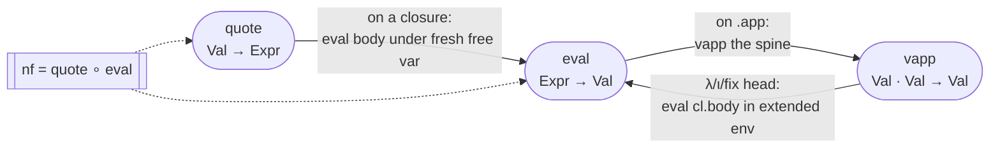
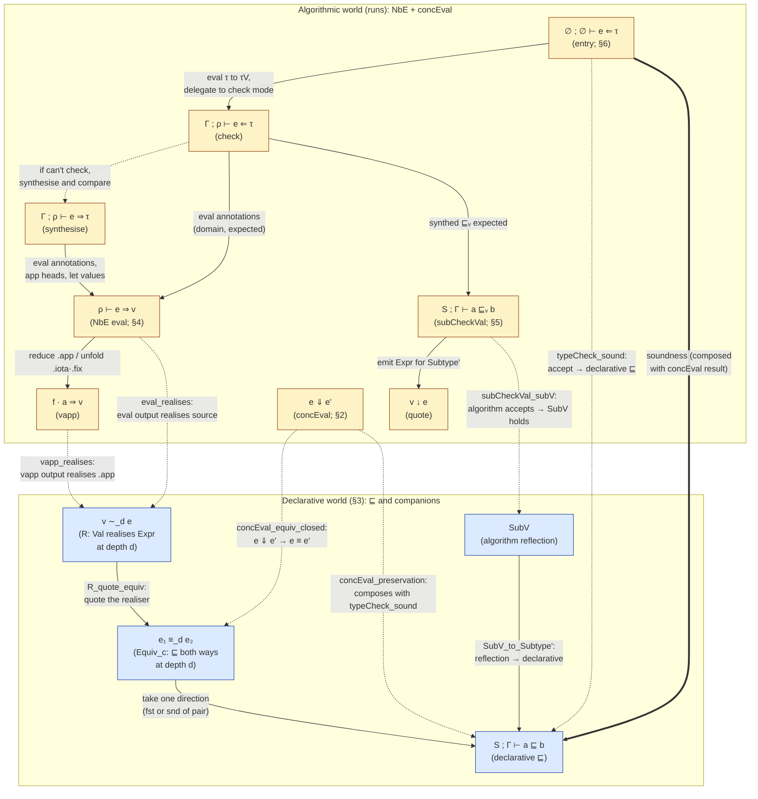

# Och: A Core Calculus with Iota/Fix, NbE, and Bidirectional Typing

Och is the core calculus on which the Ochre language's metatheory is developed.
It is a dependently-typed λ-calculus with two recursive-binder forms —
**ι** (Cedille-style self-types) and **fix** (general recursion at the type
and term level) — and a single syntactic category in which terms and types
coincide. The checker is a bidirectional type-checker layered on a
normalization-by-evaluation (NbE) core, and the subtyping relation is
equirecursive with Brandt–Henglein coinductive hypotheses.

This document specifies Och as a type system: the term syntax, the concrete
operational semantics, the declarative subtyping relation, the semantic-value
domain on which the algorithm runs, and the algorithmic typing/subtyping
judgments. Inference rules follow the indented convention described in
[docs/notation.md](../../docs/notation.md) — conclusion first, premises
indented beneath — rather than the horizontal-bar format.

### Naming convention: named binders, not de Bruijn

Throughout this document, binders and variables are written with ordinary
names (`x`, `y`, `self`, `A`, `B`, `f`, `a`, …) and substitution is written
`body[x ↦ v]`. Binders are annotated with their bound name: `λ(x : A). e`,
`ι(self : A). B`, `fix(self : A). b`, `let x = v in body`. Context lookup
is `Γ(x)`; context extension is `Γ, x : A`.

This is a presentational choice for readability, not a formalism choice.
**The Lean formalisation uses de Bruijn indices throughout** —
[`Expr.bvar`](Syntax.lean#L38), [`Expr.shift`](Syntax.lean#L112),
`body.subst 0 v`, `Γ : List Expr` indexed by position — and that is what
the `Soundness.lean` / `Subtyping.lean` statements actually prove. When
porting a rule from this document to the codebase: a named variable `x`
bound at the innermost binder becomes `bvar 0`, a variable bound `k`
binders out becomes `bvar k`, substitution `body[x ↦ v]` becomes
`body.subst 0 v` at the binding site (with `Expr.shift` composed in if
`v` lives at a different depth), and the de Bruijn shift `τ.shift(k+1)`
in the formalisation's `[S-BVar]` disappears from the named form because
named variables don't need re-indexing.

**Future work on Och/Ochre should uphold this convention** in all
externally-facing documentation, papers, and specifications — even
though the formalisation remains in de Bruijn form. Readers should never
need to understand index arithmetic to follow the type system. The de
Bruijn details are an implementation concern confined to the Lean
sources.

### Cross-references to the formalisation and decision history

Every judgment, rule, and theorem in this document is backed by a
definition or proof in the Lean codebase, and many rules reflect
specific design decisions made at specific points in the project's
history. References take two forms:

- **Code links.** Lines like
  [`Subtype'`](Subtyping.lean#L77) or
  [`concEval_equiv`](Soundness.lean#L304) point at the exact
  declaration in the Lean sources. These anchor the English
  description to the machine-checked statement. Keep them current as
  files move; a stale link is worse than no link because it silently
  claims correspondence that no longer holds.
- **Commit hashes.** Lines like
  [`fb53b4c`](https://github.com/charlielidbury/ochre/commit/fb53b4c)
  cite the commit where a design decision was made. The commit message
  is the canonical record of *why* the decision was made — often at
  more depth than fits in this document — and `claude-ask <agent-id>
  "…"` can interrogate the authoring agent for further context
  (see [`CLAUDE.md`](../../CLAUDE.md)). Include the date in prose when
  citing.

**Future work on Och/Ochre should add such references whenever a
non-obvious design choice is documented here.** If a rule has a
surprising premise, a subtle variance, an explicit-constructor
formulation where admissibility would have been natural, or any other
decision that a reader might question — cite the commit that made the
call. The commit message, not this document, is where the full
rationale lives; this document's job is to point there. Conversely, if
a rule is stated here without a backing code link, that is a signal
that either the formalisation doesn't yet match or the link was lost
during an edit; in both cases it should be added.

## 1. Syntax

The term language (source: [lean/Och/Syntax.lean](Syntax.lean#L38)) is

```
e, τ ::= x                   // variable
       | Type                // universe / top
       | Bot                 // primitive bottom (universal lower bound)
       | λ(x : τ). e         // lambda
       | e₁ e₂               // application
       | ι(self : τ). e      // self-type binder
       | fix(self : τ). e    // recursive binder
       | (e : τ)             // ascription (erased at runtime)
       | let x = e₁ in e₂    // let-binding
```

There is no separate type category: every τ above is itself a term. In the
formalisation, binders use de Bruijn indices
([`Expr.bvar`](Syntax.lean#L38)), so α-equivalent terms are syntactically
identical and capture-avoiding substitution reduces to index arithmetic
(`shift`/`subst`, [lean/Och/Syntax.lean](Syntax.lean#L112)); this document
writes bound names only.

**Iota vs fix.** Both bind a self-reference (written `self` by convention)
in their body, and both have an annotation `τ` recording the
non-self-referential type. They differ in how they unfold. A value
`v : ι(self : A). B` inhabits `B[self ↦ v]` — the body's self-reference
points at the inhabitant itself, giving dependent elimination. A value
`v : fix(self : A). B` equi-recursively equals its unfolding `B[self ↦ v]`.
Historically these were a single `μ` constructor; the split
([docs/research/iota-fix-split.md](../../docs/research/iota-fix-split.md))
gives each a narrower congruence and unfolding rule.

Throughout the paper `Γ` denotes a typing context (a finite map from
variable names to their declared types, innermost-first in the
formalisation: [lean/Och/Subtyping.lean](Subtyping.lean#L27)) and `ρ` a
value-level environment mapping variables to `Val`.

## 2. Concrete semantics — the evaluation judgment

The concrete evaluator `concEval` ([lean/Och/Eval.lean](Eval.lean#L62)) is a
substitution-based call-by-value big-step interpreter on closed terms.
Lambdas, ι, and fix are values; applications in function position unroll the
recursive binder by substituting its self-reference, then re-apply.

Write the judgment `e ⇓ v` for "closed term `e` concretely evaluates to value
`v`." Values `v ::= λ(x:τ).e | ι(self:τ).e | fix(self:τ).e | Type | x e⃗`
(neutral application spine with a stuck variable head).

```
[E-Val]                       // e ∈ {Type, λ.., ι.., fix..}
e ⇓ e

[E-Asc]
(e : τ) ⇓ v
  e ⇓ v

[E-Let]
(let x = e₁ in e₂) ⇓ v
  e₁ ⇓ v₁
  e₂[x ↦ v₁] ⇓ v

[E-App-β]
f a ⇓ v
  f ⇓ λ(x:τ). b
  a ⇓ vₐ
  b[x ↦ vₐ] ⇓ v

[E-App-ι]
f a ⇓ v
  f ⇓ ι(self:τ). b
  a ⇓ vₐ
  (b[self ↦ ι(self:τ).b]) vₐ ⇓ v

[E-App-fix]
f a ⇓ v
  f ⇓ fix(self:τ). b
  a ⇓ vₐ
  (b[self ↦ fix(self:τ).b]) vₐ ⇓ v

[E-App-Neutral]               // head is stuck
f a ⇓ f' vₐ
  f ⇓ f'
  a ⇓ vₐ
```

Free variables are not values; `concEval` returns `none` on them. Ascription
is erased at evaluation ([E-Asc]), matching the declarative rules `asc_L`/`asc_R`
(SoundnessAudit A8). The dispatch on ι/fix heads is realised in
[Eval.lean](Eval.lean#L82).

**Bot is a self-evaluating value.** Like `Type`, `Bot` evaluates to
itself via `[E-Val]` and has no corresponding `vapp` arm — the
`.lam`/`.iota`/`.fix`/`.neutral` dispatch in `vapp` doesn't cover `.bot`,
so applying an argument to Bot is *stuck* (parallel to `Type`-application).
This is intentional: Bot is a type, not a callable. The typing discipline
must ensure well-typed programs never reach `Bot a` at runtime; under the
bidirectional restriction (§6) this should not arise in practice. A formal
progress-style theorem is deferred to `progress_mod_fuel` (see §7 and
[`docs/ideas/soundness-strengthen.md`](../../docs/ideas/soundness-strengthen.md)).

This is the **operational specification** of the language. The algorithmic
type-checker is connected to it via
[`concEval_equiv`](Soundness.lean#L304) and
[`concEval_preservation`](Soundness.lean#L380). Both are stated and have
no direct `sorry`, but their transitive axiom set currently includes
`sorryAx` — they depend on `Equiv.shift`'s nil-Γ case and nine other
sorries in [`SoundnessProof.lean`](SoundnessProof.lean). See
[`PROGRESS.md`](../../PROGRESS.md) for the per-sorry status; all ten
have documented engineering routes, none are open research questions.

## 3. Declarative subtyping

Subtyping in Och means set inclusion: `A ⊑ B` iff every value of `A` is also
a value of `B`. The relation is
[`Subtype' : Seen → Ctx → Expr → Expr → Prop`](Subtyping.lean#L77), written

```
S ; Γ ⊢ a ⊑ b
```

### Context `Γ`

`Γ` is the typing context — a finite ordered list of `(variable, type)`
pairs, with the most recent binder at the front. Lookup is `Γ(x)` for
the declared type of `x`; extension is `Γ, x : A`. The context carries no
well-formedness side conditions in `Subtype'` itself — those live in the
open-context judgments used by the type-checker (`OpenCtx` in
[`SoundnessProof.lean`](SoundnessProof.lean)).

In the formalisation, `Γ : List Expr` is indexed by de Bruijn position
with the innermost binder at index 0; a use-site must shift the declared
type by the number of intervening binders (see the named form of
`[S-BVar]` below, and contrast with the formalisation's
`τ.shift(k+1)`).

### Seen set `S`

`S` is a set of pairs `(a, b)` — ancestor subtyping goals introduced by
productive unfolding rules (ι-introduction and the four `unfold_*`
rules, §3.3). The invariant: only those five rules extend `S`; every
other rule propagates it unchanged. This is the Brandt–Henglein device
for equirecursive subtyping — coinductive assumptions are only legal
after at least one productive step, so reflexivity of a non-productive
goal cannot be closed by a hypothesis.

`S` was introduced in
[`85b066e`](https://github.com/charlielidbury/ochre/commit/85b066e)
(2026-04-17) to fix SoundnessAudit A4: `dtrue ⊑ dBool` loops through a
contravariant domain that needs the same goal again; the algorithm
already closed this coinductively via its seen-set, and the declarative
relation now does too.

The "real" subtyping judgment is `∅ ; Γ ⊢ a ⊑ b` (empty hypothesis set);
non-empty `S` arises only inside a derivation.

### Rule taxonomy

The rules fall into four categories. Each serves a distinct purpose;
knowing which category a rule belongs to predicts its shape.

| Category                     | Purpose                                                                    | Rules                                                                              | Extends `S`? |
| ---------------------------- | -------------------------------------------------------------------------- | ---------------------------------------------------------------------------------- | :----------: |
| Structural (§3.1)            | Plumbing: compose, lookup, without inspecting constructors on either side  | `S-Refl`, `S-Top`, `S-BotL`, `S-Trans`, `S-Hyp`, `S-Var`                           | no           |
| Congruence (§3.2)            | Match constructor on both sides; reduce to sub-obligations with variance   | `S-Lam`, `S-App-Cong`, `S-Iota-Cong`, `S-Fix-Cong`, `S-LetE-Cong`                  | no           |
| Productive unfolding (§3.3)  | Unfold a recursive binder (ι/fix); extend `S`; enable coinductive closure  | `S-Iota-Intro`, `S-Unfold-Iota-L`, `S-Unfold-Iota-R`, `S-Unfold-Fix-L`, `S-Unfold-Fix-R` | **yes**  |
| Conversion (§3.4)            | Close under head reduction so algorithmic NbE is sound                     | `S-Beta-L/R`, `S-Let-L/R`, `S-Asc-L/R`                                             | no           |

The `S`-extension column matters: `S-Hyp` can only fire against
entries that some ancestor productive rule installed, so any path to
`S-Hyp` must cross an unfold — the productivity requirement made
mechanical.

> **Formalisation aside.** In the Lean sources, `S` is
> `List (Nat × Expr × Expr)` — each entry is depth-tagged with the
> `|Γ|` at which it was recorded, and `.hyp` shifts the entry's free
> variables to the current depth on use
> (`a.shift(|Γ|-d)`, `b.shift(|Γ|-d)`). The depth-tag was added in
> [`8d86c69`](https://github.com/charlielidbury/ochre/commit/8d86c69)
> (2026-04-19) so `ctx_extend_at`'s binder cases close with IH and goal
> seen-sets coinciding on the nose. Named-form presentation avoids all
> of this: free variables carry their own names, so no shift is ever
> required at lookup time.

### 3.1 Structural rules

"Structural" rules talk about `⊑` as a relation on terms without inspecting
either side's head constructor: reflexivity, transitivity, the top element,
hypothesis lookup, and variable lookup. These are the plumbing that lets
derivations compose; they produce no new sub-obligations about constructor
shapes.

```
[S-Refl]
S ; Γ ⊢ e ⊑ e

[S-Top]
S ; Γ ⊢ e ⊑ Type

[S-BotL]                      // Bot is the universal lower bound
S ; Γ ⊢ Bot ⊑ e

[S-Trans]                     // explicit constructor — see note below
S ; Γ ⊢ a ⊑ c
  S ; Γ ⊢ a ⊑ b
  S ; Γ ⊢ b ⊑ c

[S-Hyp]                       // (a, b) recorded under an ancestor
S ; Γ ⊢ a ⊑ b                //    productive rule
  (a, b) ∈ S

[S-Var]                       // variable's declared type
S ; Γ ⊢ x ⊑ Γ(x)
```

**Ex falso via subsumption.** There is no dedicated "absurd" eliminator
(no Coq-style `False.elim`). If `a ⊑ Bot` is derivable, then `a ⊑ e` for
every `e` via `[S-Trans]` on `[S-BotL]`. The "contradiction" discharge is
subsumption alone. This matches the DOT tradition: Bot inhabits every
type trivially in subtyping, so any term whose type is already `Bot`
flows into any expected type without further ceremony. See
[`docs/ideas/bottom.md`](../../docs/ideas/bottom.md) for design rationale.

**Why `[S-Trans]` is a constructor, not a derived theorem.** In a normal
simply-typed subtyping relation, transitivity is admissible: a standard
induction on the shape of the two derivations composes them. That argument
requires a decreasing syntactic measure — typically, both derivations get
strictly smaller in each case of the composition. Och's four `unfold_*`
rules and `iota_intro` break this: unfolding `fix(self : A). body`
replaces it with `body[self ↦ fix(self : A). body]`, which is *larger*
than the original.
There's no obvious structural measure on derivations that decreases
through an unfold, so transitivity is not derivable by induction on
derivations. The seen-set discipline of §3.3 is the coinductive
counterpart that keeps the relation consistent, but it doesn't by itself
give admissibility of `trans`.

This was the motivation for making `trans` an explicit constructor in
[`fb53b4c`](https://github.com/charlielidbury/ochre/commit/fb53b4c)
(2026-04-17, "Subtype': sync with the algorithm"). A prior
commit [`bd52114`](https://github.com/charlielidbury/ochre/commit/bd52114)
had *removed* `trans` while proving a pre-seen-set version of
monotonicity, and [`b78f29f`](https://github.com/charlielidbury/ochre/commit/b78f29f)
had briefly *proven* a `Subtype'.trans` theorem in the old setting — but
both predate the ι/fix split and the equirecursive unfolds, and neither
survived the move to the current formulation.

### 3.2 Congruence rules

Congruence rules are the opposite of structural: they *do* inspect the
head constructor on both sides, require it to match, and reduce the goal
to sub-obligations on the immediate sub-terms with appropriate variance.
They're how the relation lifts from leaves to compound terms. Each
constructor of `Expr` with a subterm (λ, ι, fix, app, let) gets one rule.
Ascriptions (`:`) are handled by the conversion rules of §3.4 rather than
a congruence, since they're computationally transparent
([SoundnessAudit A8](SoundnessAudit.lean),
[`7985ea2`](https://github.com/charlielidbury/ochre/commit/7985ea2)).

```
[S-Lam]                       // contravariant dom, covariant body
S ; Γ ⊢ (λ(x : A₁). b₁) ⊑ (λ(x : A₂). b₂)
  S ; Γ ⊢ A₂ ⊑ A₁
  S ; (Γ, x : A₂) ⊢ b₁ ⊑ b₂

[S-App-Cong]                  // args must be *equivalent* (SoundnessAudit A1)
S ; Γ ⊢ (f₂ a₂) ⊑ (f₁ a₁)
  S ; Γ ⊢ f₂ ⊑ f₁
  S ; Γ ⊢ a₂ ⊑ a₁
  S ; Γ ⊢ a₁ ⊑ a₂

[S-Iota-Cong]
S ; Γ ⊢ (ι(self : A₁). B₁) ⊑ (ι(self : A₂). B₂)
  S ; Γ ⊢ A₁ ⊑ A₂
  S ; (Γ, self : A₂) ⊢ B₁ ⊑ B₂

[S-Fix-Cong]
S ; Γ ⊢ (fix(self : A₁). b₁) ⊑ (fix(self : A₂). b₂)
  S ; Γ ⊢ A₁ ⊑ A₂
  S ; (Γ, self : A₂) ⊢ b₁ ⊑ b₂

[S-LetE-Cong]
S ; Γ ⊢ (let x = v₁ in b₁) ⊑ (let x = v₂ in b₂)
  S ; Γ ⊢ v₁ ⊑ v₂
  S ; (Γ, x : v₂) ⊢ b₁ ⊑ b₂
```

The equivalence premise on `[S-App-Cong]` (both directions on the
argument) was introduced in
[`047e59f`](https://github.com/charlielidbury/ochre/commit/047e59f)
(2026-04-17, SoundnessAudit A1). The old unidirectional rule accepted
`Pair zero unit ⊑ Pair Nat Unit` under a Church-encoded `Pair`, but that
pair could be eliminated with a projection that β-reduced the goal to
`zero → Unit ⊑ Nat → Unit`, which fails on the domain. A neutral head
can use its argument at any variance, so equivalence is the only sound
congruence. The `iota`, `fix`, and `letE` congruences were added later
alongside `Equiv.subst_resp` in
[`5169447`](https://github.com/charlielidbury/ochre/commit/5169447).

### 3.3 Productive unfolding (extend `S`)

A rule is *productive* when it replaces a goal whose head is a recursive
binder (ι or fix) with a goal where that binder has been unfolded once —
substituting the binder for its own bound variable in the body. Unfolding
makes the term *larger* in syntactic size, so no structural induction can
traverse an arbitrary chain of unfolds. Productivity instead provides a
*coinductive* handle: once at least one unfold has fired, the original
goal is guaranteed to eventually re-appear as an ancestor, at which point
`[S-Hyp]` can close the derivation. This is what makes equirecursive
subtyping consistent — any infinite derivation must pass through a
productive step infinitely often, so every goal either terminates or is
eventually discharged by a hypothesis.

The rules below are the only ones that extend `S`. All other rules
propagate `S` unchanged, which means `[S-Hyp]` is only available on paths
that have crossed at least one unfold — exactly the productivity
requirement.

```
[S-Iota-Intro]                // Cedille value-sub; checks both ann and body
S ; Γ ⊢ a ⊑ ι(self : A). B
  S' ; Γ ⊢ a ⊑ A              // S' = S ∪ { (a, ι(self:A).B) }
  S' ; Γ ⊢ a ⊑ B[self ↦ a]

[S-Unfold-Iota-L]
S ; Γ ⊢ (ι(self : A). B) ⊑ c
  S' ; Γ ⊢ B[self ↦ ι(self:A).B] ⊑ c

[S-Unfold-Iota-R]             // weaker than iota-intro; no ann premise
S ; Γ ⊢ a ⊑ ι(self : A). B
  S' ; Γ ⊢ a ⊑ B[self ↦ ι(self:A).B]

[S-Unfold-Fix-L]
S ; Γ ⊢ (fix(self : A). b) ⊑ c
  S' ; Γ ⊢ b[self ↦ fix(self:A).b] ⊑ c

[S-Unfold-Fix-R]
S ; Γ ⊢ a ⊑ fix(self : A). b
  S' ; Γ ⊢ a ⊑ b[self ↦ fix(self:A).b]
```

The `unfold_iota_R` rule was added in
[`d19f092`](https://github.com/charlielidbury/ochre/commit/d19f092) as
the weaker sibling of `iota_intro` (same conclusion, no annotation
premise) required to close `Equiv.iota_unfold` and therefore
`concEval_equiv`'s `.app`-with-`.iota`-head case.

**Worked example: `dtrue ⊑ dBool`.** With

```
dtrue := ι(self : Type).      λ(P : self → Type). λ(t : P self). λ(f : Type). t
dBool := fix(B : Type). ι(self : B). λ(P : B    → Type). λ(t : P dtrue). λ(f : P dfalse). P self
```

the subtyping check `∅ ; Γ ⊢ dtrue ⊑ dBool` loops through a
contravariant domain: `dBool`'s motive parameter is `P : dBool → Type`,
while `dtrue`'s is `P : self → Type` where `self` is the inhabitant —
ultimately `dtrue`. So the `[S-Lam]` contravariant premise for the
`P` binder demands `dBool ⊑ dtrue`… which needs the original
relationship back. Without the seen set this loops forever; with it,
the productive unfold at the top installs `(dtrue, dBool)` into `S`,
and the loop closes via `[S-Hyp]`:

Read top-down (conclusion first, premises indented beneath — the
same convention as every rule in this document). Rule annotations
are in comments; `S₁ = {(dtrue, dBool)}`.

```
∅ ; Γ ⊢ dtrue ⊑ dBool                              // root goal
  // [S-Unfold-Fix-R]  — records (dtrue, dBool) in S. Let S₁ = that.
  S₁ ; Γ ⊢ dtrue ⊑ ι(self : dBool). λ(P : dBool → Type).
                                    λ(t : P dtrue).
                                    λ(f : P dfalse).
                                    P self
    // [S-Iota-Intro]  — annotation and body premises both inherit S₁.
    //
    // Annotation premise:
    S₁ ; Γ ⊢ dtrue ⊑ dBool                         // the root goal reappears!
      // [S-Hyp]  (dtrue, dBool) ∈ S₁  ✓ closes
    //
    // Body premise (sketch, after [self ↦ dtrue] substitution):
    S₁ ; Γ ⊢ dtrue ⊑ λ(P : dBool → Type).
                     λ(t : P dtrue).
                     λ(f : P dfalse).
                     P dtrue
      // Further structural reduction via [S-Lam] etc.
      // Any path that re-encounters dtrue ⊑ dBool — e.g. the
      // contravariant P-domain premise (dBool → Type) ⊑ (dtrue → Type)
      // — closes via [S-Hyp] the same way.
```

Both branches of `[S-Iota-Intro]` find the root goal waiting in `S₁`
and close via `[S-Hyp]`. This is the Brandt–Henglein discipline in
action: recursion in the subtyping judgment is legal *only across a
productive unfold*, so non-productive loops (e.g. reflexivity-by-loop)
cannot sneak through.

### 3.4 Conversion

The algorithm normalises before comparing, so the declarative relation must
be closed under head reduction. These rules provide that closure.

```
[S-Beta-L]
S ; Γ ⊢ (λ(x : A). body) arg ⊑ b
  S ; Γ ⊢ body[x ↦ arg] ⊑ b

[S-Beta-R]
S ; Γ ⊢ a ⊑ (λ(x : A). body) arg
  S ; Γ ⊢ a ⊑ body[x ↦ arg]

[S-Let-L]
S ; Γ ⊢ (let x = val in body) ⊑ b
  S ; Γ ⊢ body[x ↦ val] ⊑ b

[S-Let-R]
S ; Γ ⊢ a ⊑ (let x = val in body)
  S ; Γ ⊢ a ⊑ body[x ↦ val]

[S-Asc-L]
S ; Γ ⊢ (e : τ) ⊑ b
  S ; Γ ⊢ e ⊑ b

[S-Asc-R]
S ; Γ ⊢ a ⊑ (e : τ)
  S ; Γ ⊢ a ⊑ e
```

Ascriptions compare their *term*, not their annotation: `Nat ⊑ (zero : Nat)`
should reduce to `Nat ⊑ zero` (false), not `Nat ⊑ Nat` (SoundnessAudit A8).

## 4. Semantic evaluation (NbE)

**Normalization by Evaluation (NbE)** is a technique for computing
normal forms of terms without implementing substitution and
β-reduction as syntactic rewrites. The idea:

1. **Evaluate** the term into a semantic domain of *values*,
   deferring the bodies of binders as closures (or as host-level
   functions in HOAS-style presentations; §4.1 explains Och's
   closure choice). β happens at the value level by extending a
   captured environment, not by substitution on syntax.
2. **Quote** the resulting value back to a syntactic term. Quoting
   walks under binders by opening closures with fresh free variables,
   and re-emits the result as a source-level expression.

Composing these two gives a normaliser: `nf e := quote(eval(e))`.
Two terms are α/β-equivalent iff they normalise to the same syntax,
which is free because the value domain already identifies
α-equivalent terms (binders become host-level functions) and β
fires automatically during `eval`. The wrinkle for open terms and
stuck computations is the **neutral** value: a semantic placeholder
that records "evaluation got stuck here" (on a free variable, or on
an eliminator with an abstract scrutinee), so quoting can re-emit
the stuck subterm as syntax rather than getting stuck itself.

Och's algorithmic checker runs on this value domain rather than on
raw syntax. α-equivalence and β-equivalence of types are free, and
dependent elimination under a binder works by opening the binder
with a fresh neutral and evaluating the body symbolically — §6.3.

**Why avoid substitution.** Och originally used an eager-substitution
evaluator `absEval : Expr → Expr` whose normaliser substituted the
argument physically into every occurrence in the body. This blew up
on dependent types: on `done_ ⊑ dNat`, `iotaIntro` substitutes the
normal form of `done_` for every `self`-ascription in `dNat`'s body,
and the term fan-out became exponential in the depth of self-references.

Concretely, imagine a body `b` that references its bound variable `x`
in `k` positions, and a substituend `T` of size `|T|`:

```
  Substitution-based (absEval):              Closure-based (NbE):
  ══════════════════════════════             ════════════════════════

     let x = T in b                              let x = T in b
             │                                           │
         [substitute]                           [bind x in env]
             │                                           │
             ▼                                           ▼

     b[x ↦ T]                                    { body = b,
                                                   env  = [x ↦ T] }
       │ │ │
       ▼ ▼ ▼
      ┌─┐┌─┐┌─┐                                  ┌─┐   (single T; k pointers
      │T││T││T│     ← T copied k times           │T│    from occurrences of x
      └─┘└─┘└─┘                                  └─┘    refer to the same node)
                                                 ▲ ▲ ▲
                                                 └─┴─┘
     size = k · |T| + O(|b|)                     size = |T| + O(|b|) + k ptrs
```

With nesting, the copies compound: three levels of `let` with `k`
uses each gives `k³` copies under substitution, but still one shared
copy under closures.

The closure-based NbE replaces each substitution with an *environment
extension* — the substituend is bound to a variable and shared across
all its uses, not copied. The NbE evaluator was introduced in
[`4488378`](https://github.com/charlielidbury/ochre/commit/4488378)
(2026-04-16) alongside the legacy `absEval`, which ran in parallel
for a few days as a divergence-detection oracle (it surfaced A1–A8
in `SoundnessAudit.lean`). Once the sweep had served its purpose,
the legacy checker was retired in
[`6772061`](https://github.com/charlielidbury/ochre/commit/6772061)
(2026-04-19); `NbE.subCheckVal` is now the sole algorithmic checker
and the Phase-2 soundness target.

### 4.1 Values and closures

[lean/Och/NbE.lean](NbE.lean#L27):

```
Val     ::= Type
          | λ(x : Val_A). Closure              // binders carry a closure
          | ι(self : Val_A). Closure
          | fix(self : Val_A). Closure
          | neutral(Neutral)

Neutral ::= free(x)                            // free variable
          | app(Neutral, Val)                  // stuck spine
          | stuckRec(Val, Val)                 // ι/fix head vs neutral arg

Closure ::= { body : Expr, env : Env }         // named-field record
Env     ::= finite map from variables to Val
```

A `Closure` is a pair — the as-yet-unevaluated source body and the
environment under which to evaluate it — packaged so that evaluation
can be deferred until the binder is opened. Its fields are accessed as
`cl.body` and `cl.env`. The annotation `Val_A` on each binder is the
already-evaluated type of the bound parameter. A `neutral` value is a
semantic placeholder that records exactly where evaluation is stuck —
`free(x)` for a free variable, `app` for a stuck application spine, and
`stuckRec` for the Och-specific case of an ι or fix head applied to a
neutral argument (the eliminator has no pattern to scrutinise, so the
application is tagged as stuck). The corresponding Lean record is
[`Closure`](NbE.lean#L45).

**Why `Closure`, not a host-level function.** The textbook NbE
presentation interprets a λ-AST-node as a literal function in the
host language — `Val.lam : (Val → Val) → Val`, so β is just
meta-level function application. Lean can't express this: its
inductive types must be strictly positive, and `(Val → Val) → Val`
has `Val` in a negative position. We produce a `Closure` instead.
A closure is as self-contained as a meta-level function would be —
it captures its own evaluation environment — so β-reduction is
"extend `cl.env` with the argument, `eval cl.body` in the extended
environment" rather than "apply the Lean function to the argument".
The NbE payoff (no substitution on `Expr`, α/β free for types) is
the same; only the mechanism differs.

> **Formalisation aside.** `free(x)` is implemented as a de Bruijn
> *level* `var k` — an index counted from the root of the context
> rather than from the innermost binder — so the same neutral stays
> stable as more binders are opened around it. The level-vs-index
> choice is why quoting takes a depth argument `k` and returns
> `bvar(k-1-l)` (see §4.2).

### 4.2 Three mutually-recursive judgments

Three relations carry the NbE machinery, each doing one job:

1. **Eval** — `ρ ⊢ e ⇒ v` ([eval](NbE.lean#L91)). Turns a source
   `Expr` into a semantic `Val`, given an environment `ρ` binding the
   expression's free variables. This is the syntactic-traversal half:
   walk the term, recurse into sub-terms, build up a value. When eval
   hits a λ/ι/fix it *doesn't* recurse into the body — it packages
   the body and the current environment into a `Closure` and returns
   that as a value, deferring body-evaluation until the binder is
   eventually opened.

2. **Value application** — `f · a ⇒ v` ([vapp](NbE.lean#L124)).
   Applies an already-evaluated value `f` to an already-evaluated
   argument `a`. This is the β-step in the semantic world: when
   `f` is a λ-closure, open it by extending its captured env with
   the argument and evaluating the closure's body; when `f` is an
   ι/fix, possibly unfold it; when `f` is a neutral, extend the
   stuck spine.

3. **Quoting** — `v ↓ e` ([quote](NbE.lean#L258)). Reads a value
   back to a source `Expr`, so the pipeline produces normal-form
   syntax at the end. To go under a binder, quoting opens the
   closure with a fresh free variable (which is why it needs eval
   in return).

**Why three?** Evaluation alone is not enough: when it encounters an
application, both sides are terms but the result of evaluating the
function is a value (typically a closure), not a term — you can't
just substitute and keep going. You need a value-level "apply me to
this argument" operation, which is `vapp`. Evaluation and vapp are
therefore mutually recursive — eval calls vapp on applications, vapp
calls eval when it opens a closure.

Quoting is the third piece because NbE's whole point is to produce a
normal-form `Expr`, not a `Val`. Values are the internal currency;
users want syntax out. Quoting is mutually recursive with eval as
well: reading a closure back requires opening it under a fresh
binder, which requires evaluating the body in an extended environment.
The normalisation function [`NbE.nf`](NbE.lean#L410) is literally
`quote ∘ eval`; the rest of §4.2 is the machinery that makes that
composition well-defined.



A fuel parameter is threaded through each of the three for
termination but elided below; an unfolding budget `unf` bounds how
many times ι/fix may unroll in a single application chain.

```
[V-Type]
ρ ⊢ Type ⇒ Type

[V-Var]
ρ ⊢ x ⇒ ρ(x)

[V-Lam]
ρ ⊢ (λ(x : A). b) ⇒ λ(x : v_A). { body = b, env = ρ }
  ρ ⊢ A ⇒ v_A

[V-Iota]
ρ ⊢ (ι(self : A). b) ⇒ ι(self : v_A). { body = b, env = ρ }
  ρ ⊢ A ⇒ v_A

[V-Fix]
ρ ⊢ (fix(self : A). b) ⇒ fix(self : v_A). { body = b, env = ρ }
  ρ ⊢ A ⇒ v_A

[V-App]
ρ ⊢ f a ⇒ v
  ρ ⊢ f ⇒ v_f
  ρ ⊢ a ⇒ v_a
  v_f · v_a ⇒ v

[V-Let]
ρ ⊢ (let x = e in b) ⇒ v
  ρ ⊢ e ⇒ v_e
  ρ, x ↦ v_e ⊢ b ⇒ v

[V-Asc]                       // computationally transparent
ρ ⊢ (e : τ) ⇒ v
  ρ ⊢ e ⇒ v
```

Value application. `vapp` is the β-step in the semantic world. The ι/fix
arms gate unfolding on `¬a.isNeutral ∧ unf > 0`: an abstract scrutinee
makes the eliminator stuck regardless of fuel, and `unf` prevents
diverging self-application on concrete arguments.

```
[VA-Lam]
(λ(x : _). cl) · a ⇒ v
  cl.env, x ↦ a ⊢ cl.body ⇒ v

[VA-Iota-Stuck]               // a neutral OR unf = 0
f · a ⇒ neutral(stuckRec(f, a))
  f = ι(self : _). _

[VA-Iota-Unfold]              // ¬a neutral ∧ unf > 0; decrement unf
f · a ⇒ v
  f = ι(self : _). cl
  cl.env, self ↦ f ⊢ cl.body ⇒ f'   // evaluate body with self bound to f
  f' · a ⇒ v

[VA-Fix-Stuck]
f · a ⇒ neutral(stuckRec(f, a))
  f = fix(self : _). _

[VA-Fix-Unfold]               // as iota
f · a ⇒ v
  f = fix(self : _). cl
  cl.env, self ↦ f ⊢ cl.body ⇒ f'
  f' · a ⇒ v

[VA-Neutral]                  // extend the spine
n · a ⇒ neutral(app(n, a))

[VA-Type]                     // types aren't applicable
Type · a ⇒ neutral(stuckRec(Type, a))
```

Quoting. Reading a value back to an `Expr` under a set of already-opened
free variables. To push quoting under a binder, a **fresh free variable**
is introduced into the value and the body is re-evaluated with the
binder's variable bound to that fresh neutral. The `app` spine rebuilds
syntactic applications; a `stuckRec(f, a)` quotes back as an ordinary
application (the stuck-ness is a value-world artifact).

In the formalisation, "fresh free variable" is implemented as a de Bruijn
level `var k` where `k` is the number of binders already opened; the
judgment therefore carries `k` and converts levels back to indices as
`bvar(k-1-l)`. The rules below use named variables.

```
[Q-Type]
Type ↓ Type

[Q-Var]                       // free variable remains free
neutral(free(x)) ↓ x

[Q-App]
neutral(app(n, a)) ↓ f' a'
  neutral(n) ↓ f'
  a ↓ a'

[Q-StuckRec]
neutral(stuckRec(f, a)) ↓ f' a'
  f ↓ f'
  a ↓ a'

[Q-Lam]                       // x fresh; open body with x bound to free(x)
(λ(_ : v_A). cl) ↓ λ(x : A'). b'
  v_A ↓ A'
  cl.env, x ↦ neutral(free(x)) ⊢ cl.body ⇒ w
  w ↓ b'

[Q-Iota] / [Q-Fix]            // symmetric to [Q-Lam]
```

Normalization is `nf e := quote(eval(∅, e))` starting from the empty
environment and no open variables ([`NbE.nf`](NbE.lean#L410)).

## 5. Algorithmic subtyping on values

[`subCheckVal`](SubCheckVal.lean#L212) is the algorithmic realisation of
§3. It operates directly on `Val`s (not on `Expr`s), so α-equivalence and
β-equivalence are free — two terms that evaluate to the same `Val` are
immediately recognised as subtype-equal. The seen-set lives at the
value level: entries are `Val × Val` pairs, recorded at the current
depth.

Write the judgment `S ; Γ ⊢ a ⊑ᵥ b` for values `a, b : Val`. Structurally it
mirrors §3 but with these algorithmic adaptations:

- **Seen-set lookup** (`.hyp` equivalent) is a pointer-sharing fast
  path: a `ptrEq`-based `Val.beq` closes a goal that has already been
  visited under a productive ancestor ([SubCheckVal.lean](SubCheckVal.lean#L40)).
- **Lam-lam** opens both closures with the *same* fresh free variable
  and recurses on the bodies under `Γ, x : A_B`.
- **Iota-R** and **fix-R** are realised as `iotaIntro` / `fixR`:
  the RHS closure is opened with the LHS value bound to `self` (so
  the self-reference is the LHS), and the resulting body is compared
  against the LHS.
- **StuckRec** arms cross-unfold until one side steps (the seen-set and
  productivity gate prevent divergence).
- The **top** rule (`_ ⊑ Type`) is an early fast path.
- The **bot** rule (`.bot, _ => .ok true`) is realised as a single
  high-priority match arm — it fires before any structural / neutral /
  ascent arm so `Bot ⊑ anything` closes immediately without traversal.
  No dual `_, .bot => .ok false` arm; rejection of `X ⊑ Bot` (for
  non-Bot `X`) emerges from fall-through. Contrast with `.type`: both
  are lattice extrema, but Type appears as an *accept* on the RHS
  (`_ ⊑ Type`), while Bot appears as an *accept* on the LHS
  (`Bot ⊑ _`). See `docs/ideas/bottom.md`.

Soundness of this algorithm against the declarative relation is
[`subCheckVal_sound`](Soundness.lean#L84): if `subCheckVal` returns
`ok true` on two closed values `a, b` and both quote to expressions
`ae, be`, then `[] ; [] ⊢ ae ⊑ be`.

## 6. Algorithmic typing

Och's type-checker is bidirectional ([lean/Och/TyCheck.lean](TyCheck.lean)):
elimination forms synthesize their type (mode `⇒`), introduction forms
check against one (mode `⇐`). The top-level wrapper [`typeCheck`](TyCheck.lean#L282)
evaluates `τ`, then calls `tyCheck` in check mode. The judgments are

```
Γ ; ρ ⊢ e ⇒ τV       synthesis  —  returns a Val type
Γ ; ρ ⊢ e ⇐ τV       checking   —  returns Bool
```

`Γ` maps free variables to their declared types (as `Val`s), and `ρ` is
the value environment mapping variables to `Val`s (fresh neutrals for
parameters introduced inside a binder). Both modes call
[`subCheckVal`](SubCheckVal.lean#L212) when they need to compare two
types.

### 6.1 Synthesis

```
[T-Var]                                          // TyCheck.lean:83
Γ ; ρ ⊢ x ⇒ Γ(x)

[T-Type]
Γ ; ρ ⊢ Type ⇒ Type

[T-Asc]                                          // TyCheck.lean:89
Γ ; ρ ⊢ (e : τ) ⇒ τV
  ρ ⊢ τ ⇒ τV
  Γ ; ρ ⊢ e ⇐ τV

[T-Lam]                                          // TyCheck.lean:110
Γ ; ρ ⊢ (λ(x : A). b) ⇒ λ(x : domV). ⟨bodyTyE, ρ⟩
  ρ ⊢ A ⇒ domV
  (Γ, x : domV) ; (ρ, x ↦ neutral(free(x))) ⊢ b ⇒ bodyTy
  bodyTy ↓ bodyTyE                // reify so the Π can be re-opened later

[T-App-β]                                        // TyCheck.lean:126
Γ ; ρ ⊢ (λ(x : A). b) a ⇒ τ'                     // β fast-path
  ρ ⊢ A ⇒ domV
  Γ ; ρ ⊢ a ⇐ domV
  ρ ⊢ a ⇒ vₐ
  (Γ, x : domV) ; (ρ, x ↦ vₐ) ⊢ b ⇒ τ'

[T-App]                                          // TyCheck.lean:152
Γ ; ρ ⊢ f a ⇒ retTy
  Γ ; ρ ⊢ f ⇒ fTy
  ρ ⊢ f ⇒ fV
  whnfPi(fV, fTy) = λ(x : dom). cl               // expose Π head
  Γ ; ρ ⊢ a ⇐ dom
  ρ ⊢ a ⇒ vₐ
  cl[x ↦ vₐ] ⇒ retTy

[T-Let]                                          // TyCheck.lean:172
Γ ; ρ ⊢ (let x = val in body) ⇒ τ
  (vV, valTy) = letBinderType(val)
  (Γ, x : valTy) ; (ρ, x ↦ vV) ⊢ body ⇒ τ

[T-Fix] / [T-Iota]                               // TyCheck.lean:97
Γ ; ρ ⊢ (fix(self : A). b) ⇒ AV                  // annotation only (bare)
  ρ ⊢ A ⇒ AV
```

**`whnfPi`** ([TyCheck.lean:56](TyCheck.lean#L56)) unfolds a fix/ι wrapper to
expose a Π (= `.lam`) head. For fix, the self is the fix itself; for ι,
the self is the *inhabitant* whose type is being computed —
`n : ι(self : A). B` means `n : B[self ↦ n]`. This drives dependent
elimination.

**A9 caveat.** `tyInfer` returns the bare annotation for fix/ι without
checking the body against it. That makes the synthesised type usable in
downstream `.app` chains but unsound on its own — `(fix(x : Nat). unit)`
synthesises `Nat` even though the body has type `Unit`. Callers that need
a verified type must route through `tyCheck` (§6.2), which uses
`subCheckVal` to compare the *unfolded* fix/ι against the expected type
([TyCheck.lean:209](TyCheck.lean#L209)).

**Bot in the bidirectional mode.** `tyInfer .bot` returns `.error` —
Bot has no synthesized type. `tyCheck .bot expected` succeeds **only
when `expected = Val.type`**; at any other expected type it falls through
to the fallback (which goes via `tyInfer`, which errors). This piggybacks
on Och's existing bidirectional mode as a *proxy* for a term/type
stratum: "checking at `Val.type` ≈ used as a type"; "checking at
anything else ≈ used as a value." The proxy leaks under type-in-type
(e.g. `(λX:Type. X) Bot` evaluates to `Val.bot` at type `Type`), but
benignly: `Val.bot` cannot be ascribed at a non-Type type, cannot be
passed to a non-Type-expecting function, and the only thing it *can*
do (appear as an annotation elsewhere) is equivalent to writing `Bot`
directly. `whnfPi fuel inhab .bot = none` — Bot is not a Π head. See
`docs/ideas/bottom.md` for the full design.

### 6.2 Checking

```
[C-Lam]                                          // TyCheck.lean:184
Γ ; ρ ⊢ (λ(x : A). b) ⇐ expected
  ρ ⊢ A ⇒ domV
  whnfPi(neutral(free(x)), expected) = λ(x : expDom). expCl
  ∅ ; Γ ⊢ expDom ⊑ᵥ domV                         // contravariant dom
  expCl[x ↦ neutral(free(x))] ⇒ expBody
  (Γ, x : expDom) ; (ρ, x ↦ neutral(free(x))) ⊢ b ⇐ expBody

[C-Let]                                          // TyCheck.lean:200
Γ ; ρ ⊢ (let x = val in body) ⇐ expected
  (vV, valTy) = letBinderType(val)
  (Γ, x : valTy) ; (ρ, x ↦ vV) ⊢ body ⇐ expected

[C-Asc]                                          // TyCheck.lean:203
Γ ; ρ ⊢ (e : τ) ⇐ expected
  ρ ⊢ τ ⇒ τV
  Γ ; ρ ⊢ e ⇐ τV
  ∅ ; Γ ⊢ τV ⊑ᵥ expected

[C-Fix] / [C-Iota]                               // TyCheck.lean:209
Γ ; ρ ⊢ e ⇐ expected                              // e ∈ {fix, ι}
  ρ ⊢ e ⇒ eV
  ∅ ; Γ ⊢ eV ⊑ᵥ expected                         // unfolds eV against expected

[C-Fallback]                                     // TyCheck.lean:232
Γ ; ρ ⊢ e ⇐ expected
  Γ ; ρ ⊢ e ⇒ τ
  ∅ ; Γ ⊢ τ ⊑ᵥ expected
```

The fallback handles all remaining forms: infer a principal type, then
subtype-check against `expected`. When no principal type is available
(no synthesis rule fires), `tyCheckFallback` re-evaluates `e` and compares
the resulting value directly against `expected`, matching the behaviour
of raw subtype checking.

### 6.3 Abstract interpretation of bodies

The essential NbE move in the type-checker is the **fresh free variable**
introduced when entering a binder (both in `[T-Lam]` and `[C-Lam]`). The
free variable acts as a symbolic "any value of type `dom`": evaluation of
the body under the extended `ρ` produces neutral-headed normal forms, and
the codomain of the expected Π is opened at the *same* fresh variable so
the body's type can be compared against a codomain that mentions the
parameter. This is how dependently-typed function bodies are checked
before any concrete argument exists.

## 7. Metatheory

Soundness theorems ([lean/Och/Soundness.lean](Soundness.lean)) link
the concrete semantics (§2), the declarative subtyping (§3), and the
algorithmic checker (§§4–6). The diagram below unifies three views:
the external soundness claim, the internal algorithmic relations, and
the declarative / intermediate relations the proofs route through.



Reading guide:

- **Algorithmic world (yellow)**: what actually runs. `typeCheck` is
  the user-facing entry. It dispatches to the bidirectional pair
  `tyInfer ⇒` (synthesise a type) and `tyCheck ⇐` (check against a
  given type), which in turn call `NbE eval` for Val-level computation,
  `vapp` for Val-level application, and `subCheckVal` for subtype
  comparison between Vals (which uses `quote` to close proof
  obligations back to Expr). `concEval` runs separately as the
  big-step Expr-level evaluator.
- **Declarative world (blue)**: the formal semantics. `Subtype'` is
  the derivation relation (§3). `SubV` mirrors `subCheckVal`'s
  match-arms 1-to-1 and bridges back to `Subtype'` via
  `SubV_to_Subtype'`. `Equiv_c d e₁ e₂` is `Subtype'` in both
  directions at depth d. `R m d v e` (realisation) connects a Val
  to the Expr it represents at step index m and depth d.
- **Solid arrows** inside each subgraph are call / derivation
  dependencies (typeCheck calls tyCheck calls NbE eval; SubV refines
  Subtype'; Equiv_c decomposes to Subtype'; etc.).
- **Dashed arrows** between the two worlds are *soundness theorems*:
  each says "algorithm says OK ⟹ declarative derivation exists."
  Every declaration-level sorry in `SoundnessProof.lean` lives on one
  of these dashed arrows.
- **The heavy arrow `soundness (composed)`** is the user-level
  composition: "if `typeCheck e τ` accepted AND `concEval e` produced
  some e', then e' declaratively subtypes τ." It goes through
  `typeCheck_sound` + `concEval_preservation` under the hood.

`concEval_equiv_closed` sits separately: it establishes declarative
equivalence between `e` and `e'` via one-step rules (β, ι-unfold,
fix-unfold, asc-erase) independently of typing. `concEval_preservation`
composes it with `typeCheck_sound` to land on `Subtype'`.

The blocked Phase 1 sorries (per
`docs/ideas/sorry-closure-plan.md`) all live on the `eval_realises` /
`vapp_realises` / `R_quote_equiv` / `typeCheck_sound` dashed arrows —
specifically at points where these theorems need a `quote`-succeeds
witness on intermediate closure values. The research note
`docs/ideas/quote-witness-feasibility.md` proves that witness cannot
be derived structurally in untyped OCH.

**Subtyping soundness.**
[`subCheckVal_sound`](Soundness.lean#L84) — if the algorithm accepts two
closed values and they quote back to expressions, the quoted pair is
declaratively a subtype.

```
subCheckVal n Γ=∅ ρ=∅ a b = ok true
  ∧ quote(a) = some aₑ
  ∧ quote(b) = some bₑ
 ⟹  ∅ ; ∅ ⊢ aₑ ⊑ bₑ
```

The proof goes via `subCheckVal_subV` (algorithm-reflection to an
intermediate value-level relation `SubV`) and `SubV_to_Subtype'`
(readback bridge).

**Typing soundness.**
[`typeCheck_sound`](Soundness.lean#L264) — if the top-level checker
accepts `e` at `τ` (both closed, both normalising within the proof's
global fuel), then `∅ ; ∅ ⊢ e ⊑ τ` declaratively.

**Preservation.**
[`concEval_equiv`](Soundness.lean#L304) strengthens the forward direction
into a declarative *equivalence*: `e ⇓ e'` implies both
`∅ ; ∅ ⊢ e' ⊑ e` and `∅ ; ∅ ⊢ e ⊑ e'`. The one-step equivalences
needed — β, let-unfold, ι-unfold, fix-unfold, asc-erase — come from
[`Equiv.subst_resp`](SoundnessProof.lean), `beta_L`/`_R`, `unfold_iota_R`,
`unfold_fix_R`, `asc_L`/`_R`. Type preservation
[`concEval_preservation`](Soundness.lean#L380) follows by transitivity.

**End-to-end.**
[`soundness`](Soundness.lean#L388) composes the two: if `typeCheck e τ`
accepts and `e ⇓ e'`, then `∅ ; ∅ ⊢ e' ⊑ τ` — the runtime result
declaratively inhabits the declared type.

```
soundness :
  typeCheck n e τ = ok true
  ∧ concEval n e = some e'
 ⟹  ∅ ; ∅ ⊢ e' ⊑ τ
```

The theorem carries closed-ness and normalisation side-conditions on
`e` and `τ`; the latter is inherent (quote-totality is not derivable from
eval-totality alone) and in practice is discharged by `native_decide`
for any concrete source input.

### 7.1 What soundness promises to the programmer

Two separable runtime properties a type system can promise:

1. **Termination.** Running a well-typed program eventually produces a
   value. A totality / normalization claim.
2. **No runtime type errors.** Conditional on the program *not*
   diverging, the value it produces is well-formed and the program
   never reaches a stuck state — applying a non-function, scrutinising
   something with no eliminator, dereferencing an unbound variable,
   etc.

Och **does not aim to prove (1).** Consistency and normalization are
explicitly deferred per the project goal; the calculus admits
non-terminating terms by design (type-in-type; general recursion via
`fix`). A programmer writing Och should assume any program *may*
diverge and plan accordingly — in practice, `native_decide`-style
tactics exhaust a fuel budget and report exhaustion, rather than
looping forever.

Och **does aim to prove (2)**, and this is the real runtime guarantee
of the type system.

#### The programmer-facing contract

The language expects the following discipline at any boundary where
an `Expr` is about to be run:

```
match typeCheck n e τ with
  | ok true  => concEval n' e     // safe: only failure is fuel
  | _        => reject
```

That is: **run `typeCheck` first; only call `concEval` if it
succeeded.** The contract the type system offers the programmer is
expressed by the conjunction

```
progress_mod_fuel  (aspirational) :
  typeCheck n e τ = ok true
  ∧ e, τ closed
 ⟹  ∀ n'. concEval n' e ∈ { some v (well-formed), none-due-to-fuel }
```

— i.e. the only reason `concEval n' e` returns `none` on a typed
closed term is fuel exhaustion, never "the evaluator hit an arm it
couldn't handle." No application-of-a-non-function, no
scrutinee-without-a-match. If the program halts within its budget, the
programmer gets a well-formed value; if it doesn't halt, they're
guaranteed only that it's still running, not that it's broken.

#### What holds and what doesn't

| Property                                              | Status                |
| ----------------------------------------------------- | --------------------- |
| `typeCheck` accepts ⟹ `Subtype' ∅ ∅ e τ` declaratively | **proven** (mod sorries — §7.2) |
| `Subtype'` preserved under one step of `concEval`     | **proven** (mod sorries) |
| Composed preservation (`soundness`)                   | **proven** (mod sorries) |
| `typeCheck` accepts ⟹ `concEval` only fails by fuel (`progress_mod_fuel`) | **not stated, not proven** |
| `typeCheck` accepts ⟹ `concEval` terminates at some fuel | **not pursued** |

`soundness` today is a **preservation-only** theorem: it assumes
`concEval` returned a value and concludes the result has the declared
type. It does not claim evaluation runs without stuck arms.

#### What does *not* hold internally

It is **not** a current invariant that `Val` or `Closure` inhabitants
held during type checking witness any prior well-typedness. `eval`
runs speculatively on sub-expressions *before* they are themselves
checked:

- `tyInfer` on `λ(x : A). b` evaluates `A` before checking that
  `A : Type` ([TyCheck.lean:111](TyCheck.lean#L111)).
- `tyCheck` on `λ(x : A). b` evaluates `A` before comparing it to the
  expected domain ([TyCheck.lean:185](TyCheck.lean#L185)).
- `tyCheck` on `(e : τ)` evaluates `τ` without checking
  `τ : Type` ([TyCheck.lean:204](TyCheck.lean#L204)).
- Top-level `typeCheck` evaluates the user-supplied `τ` with no prior
  kinding check.

At each of those points, any nested lambda gets packaged into a
`Closure` whose body has not been type-checked. The checker works
correctly because it catches errors *later* via `subCheckVal`
failures; but "closures only hold well-typed bodies" is **not** a
theorem about the current code.

`Val`/`Closure` are internal scratch data structures used by the
algorithm. They are not a carrier of well-typedness proofs. The
soundness story lives entirely at the `Expr`/`typeCheck`/`concEval`
boundary, not inside the NbE machinery.

#### What would close the gap

To upgrade `progress_mod_fuel` from aspirational to proven, two pieces
are needed:

1. A **kinding discipline** in `tyCheck`: wherever a type is stored
   into `Γ` (ascription, `whnfPi` domain, top-level entry), verify
   it has type `Type` first. This rules out the stuck arms in
   `concEval` (application of `Type`, application of a free
   variable) for typed inputs.
2. A **progress lemma** for `concEval`: by induction on `Subtype'`,
   show that every stuck arm contradicts the declarative relation.

Closing this is the next metatheory milestone after the ten
`SoundnessProof.lean` sorries land. In the meantime, a cheaper
near-term win — making the programmer contract machine-enforced
rather than documented — would be to bundle the two calls at the
API surface:

```
safeEval : (e τ : Expr) → (n : Nat) → SafeResult
  -- internally: runs typeCheck first, short-circuits on failure
```

or, using dependent types in Lean,

```
safeEval : (e τ : Expr) → typeCheck n e τ = .ok true → Nat → Option Val
```

The first is ergonomic and moves the discipline into a single
checked call site. The second makes the obligation a Lean-level type,
so you can't even call the evaluator without a proof in hand. Neither
requires restructuring the internals; both would materially tighten
what "runtime safety" means in practice.

Separately, the design direction of making well-typedness an
invariant of the AST itself — a typed syntax `WTExpr Γ τ` produced
by `tyCheck` and consumed by `concEval` — is being investigated; see
[`docs/ideas/intrinsic-typing.md`](../../docs/ideas/intrinsic-typing.md).

### 7.2 Axiom status

**(2026-04-23 update).** `typeCheck_sound`, `concEval_equiv`,
`concEval_preservation`, `soundness` are stated with no direct
`sorry`, but `#print axioms` reports `sorryAx` in the transitive
closure. Four declaration-level sorries remain in
[`SoundnessProof.lean`](SoundnessProof.lean) —
`eval_vapp_preserves_fullyQuotable`, `quoteClosure_realises`,
`vapp_realises`, and `tyInfer_sound_open`. An earlier assessment
(2026-04-21) characterised all remaining sorries as "engineering
routes, none research questions." That assessment has been
**falsified** for two of the four.

- **`eval_vapp_preserves_fullyQuotable` is formally impossible to
  strengthen** (without typing-with-normalization invariants). The
  implication `Val.fullyQuotable d v → ∃ q, quote fuelω d v =
  some q` reduces to the Halting Problem for untyped λ-calculus
  via an explicit Ω-combinator closure counterexample. See
  [`docs/ideas/quote-witness-feasibility.md`](../../docs/ideas/quote-witness-feasibility.md).
  This is a **fundamental limit of non-total OCH**, not
  engineering.

- **`quoteClosure_realises` is blocked** at the mutual-block level:
  Lean's termination checker rejects every lex measure tested for
  the `R_quote_equiv`-closure-case inline; the post-mutual route
  cascades `sorryAx` via pre-mutual `R_quote_equiv`'s own closure
  cases.

- **`vapp_realises` and `tyInfer_sound_open` Category A** depend on
  the impossibility above — they inherit its blockers.

- **`tyInfer_sound_open` Category B** would close given a
  ~300–500 LOC `Subtype'.unshift_head` structural-induction proof
  (substitution-based; plan documented in
  [`Subtyping.lean`](Subtyping.lean)). Tractable engineering, not
  research, but beyond single-session subagent budgets to date.

- **`tyInfer_sound_open` Category C (A9)** is intentionally sorried
  — the algorithm is correct, the proof statement is the bug. See
  DECISION-LOG 2026-04-22.

**The honest reading**: the residual sorries map OCH's non-totality
boundary. §7.1 already states Och does not aim to prove
termination / progress; the fullyQuotable-quote-termination
implication is a concrete instance of that non-goal. Closing the
declaration-level sorries against current preservation-only
soundness is not engineering work in the general case — it requires
either (a) accepting the boundary as OCH's design, (b) pursuing
[Option 1.75: a typed NbE fundamental lemma](../../docs/ideas/quote-witness-feasibility.md)
(2–4 week research-scale effort), or (c) the orthogonal Phase 2
`progress_mod_fuel` refactor
([`soundness-strengthen.md`](../../docs/ideas/soundness-strengthen.md)),
which has independent value but does NOT subsume the closure-eval
divergence issue.

Full post-mortem at
[`docs/ideas/sorry-closure-plan.md`](../../docs/ideas/sorry-closure-plan.md).

**Phase 1 vs Phase 2 for Bot.** The native `Bot` primitive landed
without re-opening any sorry. Phase 1 (this one): add `Expr.bot`,
extend all structural predicates, add `[S-BotL]` declaratively and
the `.bot, _ => .ok true` algorithmic arm, verify no regression on
the Std test battery. The existing preservation-only `soundness`
theorem is unaffected — Bot-application's stuckness returns `none`
and vacuously satisfies the preservation implication. Phase 2 —
strengthening to `progress_mod_fuel` so well-typed programs
*cannot* stuck at runtime — requires refactoring `concEval`'s return
type to distinguish fuel exhaustion from stuckness; see
[`docs/ideas/soundness-strengthen.md`](../../docs/ideas/soundness-strengthen.md)
for the separate proposal. This is not part of Phase 1.

## Appendix A. Declarative typing (derived)

Och has no declarative typing relation as a first-class inductive; the
algorithmic judgments in §6 are the typing spec, with soundness against
`Subtype'` in §7. For readers who want the textbook form, the following
relation `Γ ⊢ e : τ` is the clean projection of the algorithm modulo the
A9 fix/ι caveat. It is not defined in the codebase.

```
[D-Var]
Γ ⊢ x : Γ(x)

[D-Type]
Γ ⊢ Type : Type

[D-Lam]
Γ ⊢ (λ(x : A). b) : (λ(x : A). B)                // Π = λ in Och's syntax
  Γ ⊢ A : Type                                   // well-formed dom
  (Γ, x : A) ⊢ b : B

[D-App]
Γ ⊢ f a : B[x ↦ a]
  Γ ⊢ f : (λ(x : A). B)
  Γ ⊢ a : A

[D-Let]
Γ ⊢ (let x = v in b) : τ
  Γ ⊢ v : A
  (Γ, x : A) ⊢ b : τ

[D-Asc]
Γ ⊢ (e : τ) : τ
  Γ ⊢ τ : Type
  Γ ⊢ e : τ

[D-Iota]                                         // inhabitant sees self
Γ ⊢ v : (ι(self : A). B)
  Γ ⊢ A : Type
  (Γ, self : A) ⊢ B : Type
  Γ ⊢ v : A
  Γ ⊢ v : B[self ↦ v]

[D-Fix]
Γ ⊢ (fix(self : A). b) : A
  Γ ⊢ A : Type
  (Γ, self : A) ⊢ b : A

[D-Sub]                                          // subsumption
Γ ⊢ e : B
  Γ ⊢ e : A
  ∅ ; Γ ⊢ A ⊑ B
```

`[D-Iota]` reflects the Cedille semantics: an ι-value `v` must inhabit
both the bare annotation `A` and the body `B[self ↦ v]` with the
self-reference instantiated to `v` itself. The algorithmic A9 caveat on
`[T-Fix]`/`[T-Iota]` shows that this declarative form is not yet matched
— `tyInfer` returns the bare annotation without verifying the body.
Bringing the checker into line with `[D-Iota]`/`[D-Fix]` (checking the
body against the annotation under a self-hypothesis) is future work.
